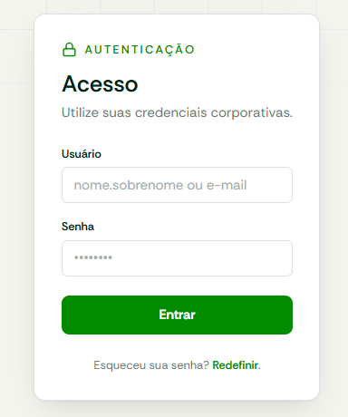
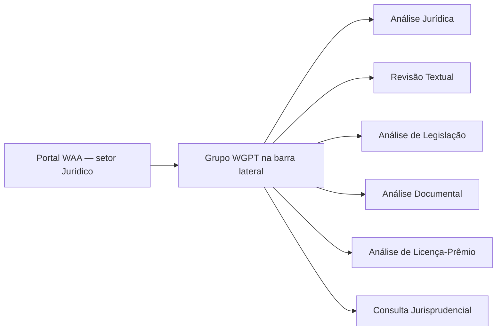
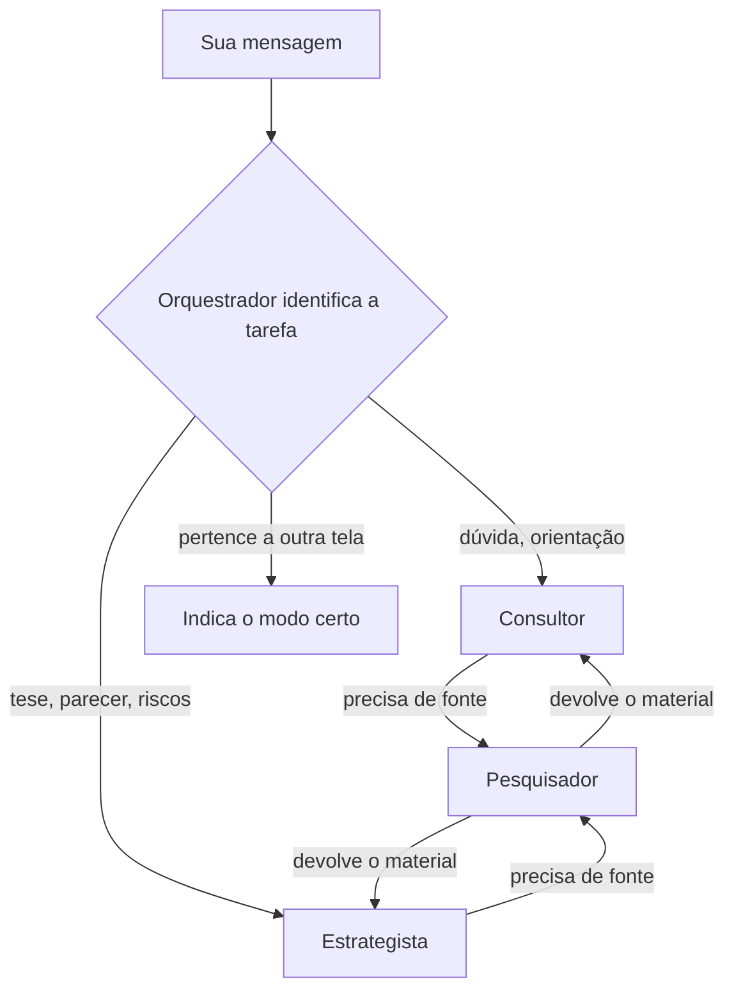
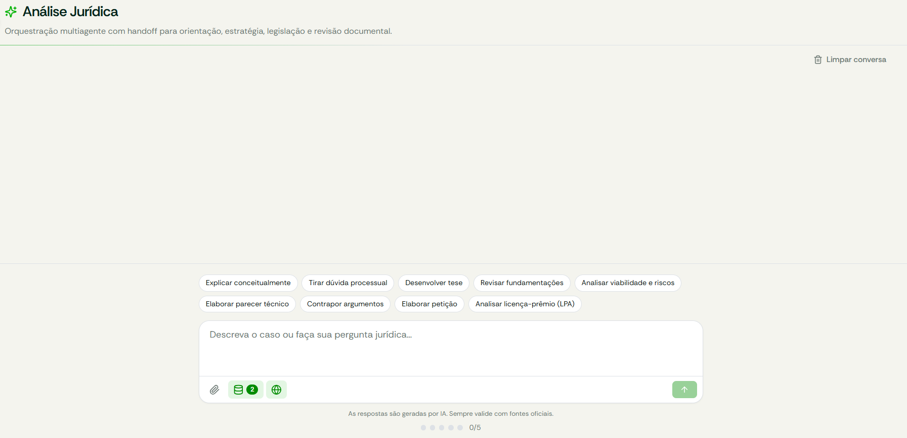
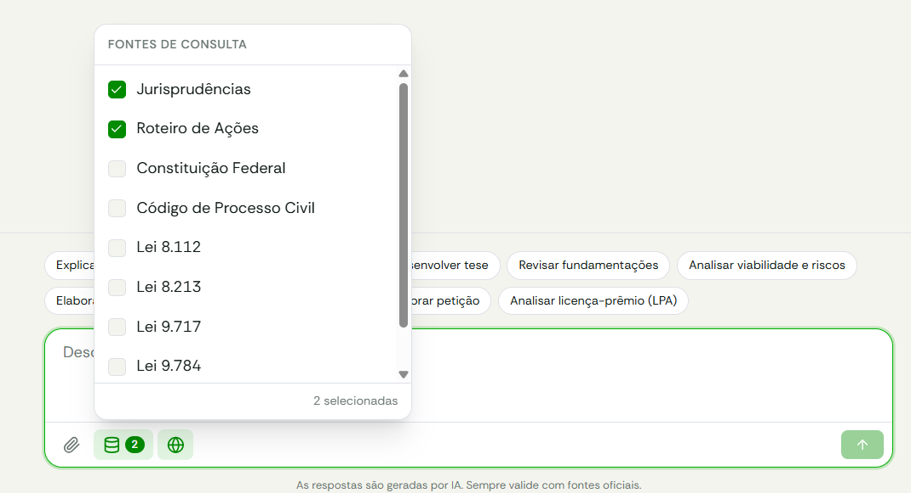
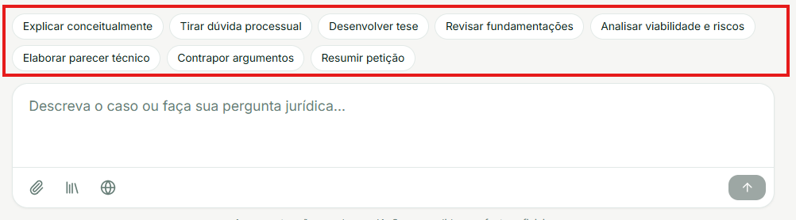
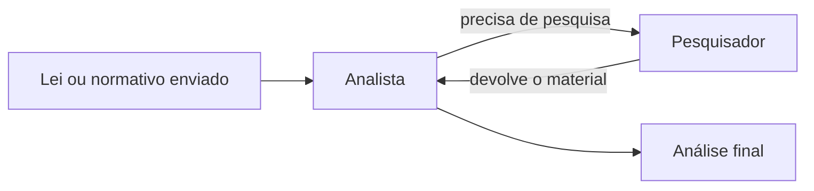
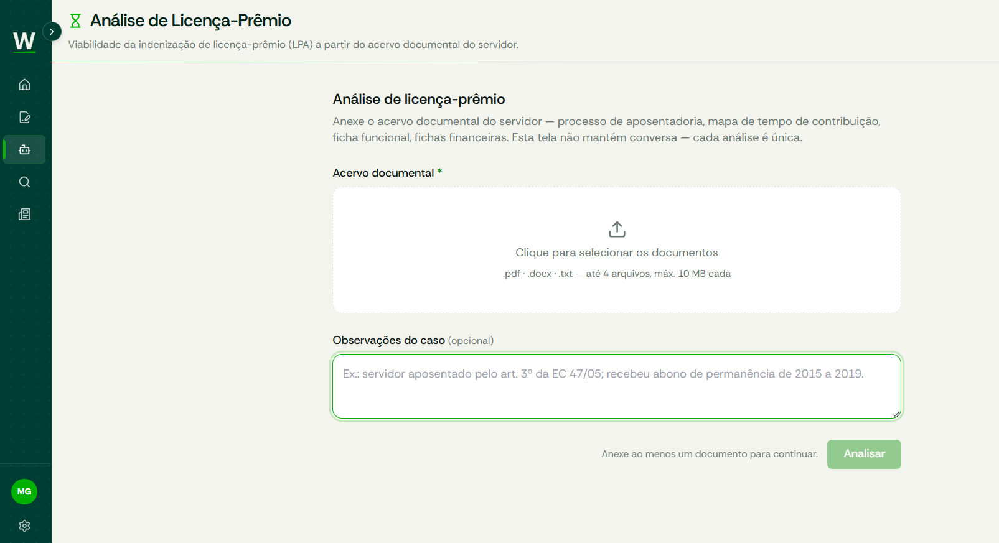

# Manual do Usuário — WGPT

> **WGPT — Assistente jurídico**, no Portal WAA (setor Jurídico).
> Atualizado em 05/10/2026, com base no código do Portal WAA (commit `44dfb74`).

Este manual explica **o que cada tela faz**, **como a IA decide quem responde** e **como escrever pedidos** para obter as melhores respostas.

## Sumário

- [Manual do Usuário — WGPT](#manual-do-usuário--wgpt)
  - [Sumário](#sumário)
  - [1. O que é o WGPT](#1-o-que-é-o-wgpt)
  - [2. Antes de começar](#2-antes-de-começar)
  - [3. Primeiro resultado](#3-primeiro-resultado)
  - [4. Chat com IA — Análise Jurídica](#4-chat-com-ia--análise-jurídica)
    - [4.1 Como o Orquestrador escolhe o agente certo](#41-como-o-orquestrador-escolhe-o-agente-certo)
    - [4.2 Os agentes e suas especialidades](#42-os-agentes-e-suas-especialidades)
    - [4.3 Usar a tela](#43-usar-a-tela)
    - [4.4 Escolher as fontes de consulta](#44-escolher-as-fontes-de-consulta)
  - [5. Detalhar pedidos](#5-detalhar-pedidos)
    - [5.1 Use as sugestões de instrução](#51-use-as-sugestões-de-instrução)
    - [5.2 Exemplos — do genérico ao eficaz](#52-exemplos--do-genérico-ao-eficaz)
  - [6. Revisar um texto — Revisão Textual](#6-revisar-um-texto--revisão-textual)
  - [7. Estudar uma lei — Análise de Legislação](#7-estudar-uma-lei--análise-de-legislação)
  - [8. Extrair informações de um documento — Análise Documental](#8-extrair-informações-de-um-documento--análise-documental)
  - [9. Analisar licença-prêmio — Análise de Licença-Prêmio](#9-analisar-licença-prêmio--análise-de-licença-prêmio)
  - [10. Pesquisar jurisprudência — Consulta Jurisprudencial](#10-pesquisar-jurisprudência--consulta-jurisprudencial)
    - [10.1 Busca manual (BNP/CNJ)](#101-busca-manual-bnpcnj)
    - [10.2 Busca com IA](#102-busca-com-ia)
  - [11. Anexar arquivos](#11-anexar-arquivos)
  - [12. Avaliar uma resposta](#12-avaliar-uma-resposta)
  - [13. Guardar o seu trabalho (exportar)](#13-guardar-o-seu-trabalho-exportar)
  - [14. Quando algo dá errado](#14-quando-algo-dá-errado)
  - [Changelog](#changelog)

---

## 1. O que é o WGPT

O WGPT é um assistente jurídico com inteligência artificial, dividido em **seis telas** (chamadas de *modos*). Cada modo resolve um tipo de tarefa:

| Modo (nome na barra lateral) | Para que serve | Tem conversa? |
|---|---|---|
| **Análise Jurídica** | Dúvidas, teses, estratégias, pareceres e riscos. Por trás, vários agentes especializados dividem o trabalho (seção 4). | Sim, até 5 mensagens |
| **Revisão Textual** | Revisão ortográfica, de clareza ou de estrutura de um texto jurídico. | Não — resultado único |
| **Análise de Legislação** | Estudo de uma lei, portaria ou normativo: adequação, riscos e oportunidades. | Não — resultado único |
| **Análise Documental** | Resumo e extração de elementos de um documento (partes, prazos, valores, cláusulas…), conforme as suas instruções. | Não — resultado único |
| **Análise de Licença-Prêmio** | Viabilidade da indenização de licença-prêmio (LPA) a partir do acervo documental do servidor (seção 9). | Não — resultado único |
| **Consulta Jurisprudencial** | Busca manual no Banco Nacional de Precedentes (BNP/CNJ) ou busca com IA a partir do seu caso concreto. | Não |

**O que o WGPT não faz:**

- Não guarda o seu histórico em servidor — conversas e resultados ficam só na aba do navegador (seção 13).
- Não substitui a conferência na fonte. Toda tela lembra: *"As respostas são geradas por IA. Sempre valide com fontes oficiais."*

---

## 2. Antes de começar


- **Acesse ao Portal WAA utilizando utilizando seu e-mail corporativo.** (login do escritório).
- Caso necessite redefinir sua senha, selecione a opção abaixo, e você receberá um link para redefinição no seu e-mail.
> 
  
---

## 3. Primeiro resultado

1. Entre no Portal WAA e selecione a opção  **WGPT**.
2. Na barra lateral, escolha **Análise Jurídica**. 
3. Clique na sugestão **Explicar conceitualmente**, acima do campo de mensagem.
4. Digite: `Requisitos de estabilidade do servidor público estatutário segundo a Lei 8.112.`
5. Pressione **Enter** (ou clique na seta).
6. Acompanhe o painel de raciocínio: ele mostra qual agente está trabalhando e quais fontes consultou.
7. A resposta aparece na conversa. Abaixo dela, a pergunta *"Esta resposta foi útil?"* com os polegares.

*Figura 1 — Navegação entre os modos do WGPT.*
O grupo WGPT da barra lateral dá acesso direto a cada um dos seis modos.



---

## 4. Chat com IA — Análise Jurídica

### 4.1 Como o Orquestrador escolhe o agente certo

Sua mensagem não é respondida por um único robô genérico. Ela passa primeiro pelo **Orquestrador**, que lê o pedido (e a sugestão de instrução que você selecionou, se houver — seção 5) e decide **qual especialista** assume a resposta. O Orquestrador nunca elabora a resposta jurídica — só direciona. Quando a sugestão selecionada e o texto apontam para agentes diferentes, **a sugestão selecionada prevalece**.

Antes de direcionar, o Orquestrador também:

- **Responde perguntas sobre a própria plataforma** — por exemplo, "quais análises você consegue fazer?".
- **Pede esclarecimento em pedidos genuinamente ambíguos** — por exemplo, "preciso de uma análise", sem dizer de quê. Se o pedido já permite inferir a tarefa, ele segue direto, sem perguntas desnecessárias.
- **Indica a tela certa quando o pedido pertence a outro modo** — resumir um documento, estudar uma lei, revisar um texto, buscar precedentes a partir de um caso ou analisar o acervo documental de um servidor para licença-prêmio não são feitos na conversa: ele responde em uma ou duas frases apontando a tela correspondente na barra lateral.
- **Recusa demandas fora das áreas de atuação** do sistema, explicando brevemente os agentes disponíveis.

*Figura 2 — Quem responde na Análise Jurídica.*
O Orquestrador envia o pedido a um de dois especialistas; qualquer um deles pode chamar o Pesquisador antes de concluir.



### 4.2 Os agentes e suas especialidades

| Agente | Especialidade | Responde você diretamente? |
|---|---|---|
| **Orquestrador** | Identifica a tarefa e passa ao especialista certo. Explica as funcionalidades da plataforma, pede esclarecimento em pedidos ambíguos e indica a tela certa quando o pedido é de outro modo. **Não pesquisa** e não elabora a resposta jurídica. | Só nas situações acima |
| **Consultor** | Orientações jurídicas objetivas: explicações conceituais e dúvidas processuais. | Sim |
| **Estrategista** | Teses, estratégias de defesa, revisão de fundamentações, pareceres técnicos, análise de viabilidade e riscos, contraposição de argumentos. | Sim |
| **Pesquisador** | Busca jurisprudência, legislação e conteúdo na internet (seção 4.4). **Nunca responde você** — devolve o material para o agente que o chamou. | Não |

Pontos importantes:

- Quem decide chamar o Pesquisador é o **especialista que está com a tarefa**, quando percebe que precisa de uma fonte antes de concluir. O Orquestrador não pesquisa.
- A análise do acervo documental de um servidor para licença-prêmio **não é feita na conversa**: use a tela **Análise de Licença-Prêmio** (seção 9). Dúvidas conceituais sobre licença-prêmio, sem documentos a analisar, continuam sendo respondidas aqui, pelo Consultor ou pelo Estrategista.

### 4.3 Usar a tela

Tela da Análise Jurídica com: 
clipe de anexo, ícone "Consultar fontes", ícone "Buscar na web", contador de mensagens, botões "Exportar .docx" e "Limpar conversa".
> 
1. (Opcional) Clique em uma **sugestão de instrução** acima do campo de mensagem (seção 5). As sugestões aparecem só enquanto a conversa está vazia.
1. (Opcional) Clique no **clipe** para anexar até **4 arquivos** por mensagem (seção 11).
2. (Opcional) Escolha as **fontes de consulta** (seção 4.4).
3. Escreva a mensagem e pressione **Enter**. Para quebrar linha sem enviar, use **Shift + Enter**.
4. Acompanhe o **painel de raciocínio**, que mostra em tempo real qual agente está ativo, quando há repasse para outro agente e quais ferramentas de pesquisa foram consultadas.
5. Para interromper uma resposta em andamento, clique em **Cancelar** (o botão de envio vira "Cancelar" durante a resposta).

**Limite de 5 mensagens por conversa.** O contador abaixo do campo mostra quantas você já usou (por exemplo, `3/5`). Ao atingir o limite, aparece *"Você atingiu o limite de 5 mensagens nesta conversa."* com os botões **Exportar .docx** e **Nova conversa**.

**Limpar conversa** (topo da tela) apaga a conversa atual. Antes, o sistema pede confirmação: *"Sua conversa atual será perdida. Lembre-se de exportá-la antes de continuar."*

### 4.4 Escolher as fontes de consulta

Ao lado do clipe, dois ícones restringem onde o Pesquisador busca informação.

> 

- **Consultar fontes** (ícone de banco de dados) — abre a lista **Fontes de consulta** com nove bases: Jurisprudências, Roteiro de Ações, Constituição Federal, Código de Processo Civil, Lei 8.112, Lei 8.213, Lei 9.717, Lei 9.784 e Lei 12.772. O número ao lado do ícone mostra quantas estão marcadas. As marcações ficam valendo até você limpar a conversa.
- **Buscar na web** (ícone de globo) — habilita pesquisa na internet, restrita a fontes jurídicas: wagner.adv.br, planalto.gov.br, conjur.com.br e lexml.gov.br. Vale só para a mensagem que você está enviando; desmarca-se sozinho depois.

Se nenhuma fonte for marcada, o Pesquisador decide sozinho o que consultar. Marcar fontes específicas é recomendado quando você já sabe qual legislação rege o caso — reduz buscas desnecessárias e deixa a resposta mais objetiva.

**Sobre a fonte "Jurisprudências":** ela faz uma **única busca combinada** — primeiro na base interna de precedentes do escritório e, em seguida, na web restrita a sites oficiais (STJ, STF, BNP/CNJ, CJF, TRF1 a TRF5, TJRS, TJAP e o site do escritório), inclusive lendo acórdãos em PDF publicados nesses sites. O Jusbrasil é excluído. Na prática:

- Você **não precisa** marcar o globo para obter jurisprudência atual — a busca de jurisprudência já cobre esses sites.
- Cada ferramenta de pesquisa roda **uma vez por pedido**. Se o pedido envolver **dois assuntos distintos**, o agente pode pesquisar os dois na mesma busca — o painel de raciocínio mostra os dois temas separados por `|`, e os resultados são divididos entre eles. Se o painel de raciocínio mostrar que o agente "já utilizou essa ferramenta", não é erro: ele vai concluir com o material que já obteve. Para uma nova busca com outro recorte, envie uma nova mensagem.

---

## 5. Detalhar pedidos

Quanto mais contexto e mais claro o objetivo, melhor o Orquestrador identifica a tarefa e melhor é a resposta. Evite pedidos genéricos, especialmente quando há um documento anexado.

### 5.1 Use as sugestões de instrução

> 

| Categoria | Sugestão | Quem responde |
|---|---|---|
| **Orientação** | Explicar conceitualmente • Tirar dúvida processual | Consultor |
| **Estratégia** | Desenvolver tese • Revisar fundamentações • Analisar viabilidade e riscos • Elaborar parecer técnico • Contrapor argumentos | Estrategista |


A sugestão selecionada é somada à sua mensagem no envio e se desmarca sozinha depois — você pode digitar livremente além dela. Clique de novo na sugestão para desmarcá-la antes de enviar.

### 5.2 Exemplos — do genérico ao eficaz

| ❌ Evite | ✅ Prefira | 💡 Motivo |
|---|---|---|
| "Me ajude com essa petição" (com anexo) | "Analise a viabilidade de recurso neste acórdão anexo, focando em prequestionamento e violação ao art. 927 do CPC. Traga um parecer estruturado com riscos e prazo recursal." | Explicar o documento e o que você quer dele poupa o esforço do agente em adivinhar a tarefa e entender o anexo. |
| "O que diz a lei sobre isso?" | "Explique conceitualmente os requisitos de estabilidade do servidor público estatutário segundo a Lei 8.112, citando os artigos aplicáveis." | Define o objeto central da análise sem que o agente precise adivinhar. |
| "Essa tese está boa?" | "Revise as seguintes fundamentações e aponte contradições ou lacunas argumentais, sugerindo ajustes." | Prioriza os elementos que o agente deve analisar. |
| "Veja a licença-prêmio desse servidor" (na conversa) | Usar a tela **Análise de Licença-Prêmio** e anexar o mapa de tempo de contribuição, o processo de aposentadoria e a ficha funcional (seção 9). | A análise do acervo não é feita na conversa — o Orquestrador vai indicar essa tela. Sem os documentos, os dados viram pendência, não estimativa. |
| "Resume esse documento" (na conversa) | Usar a tela **Análise Documental** e marcar "Resumo do documento" (seção 8). | Resumos não são feitos na conversa — o Orquestrador vai indicar essa tela. |

Dicas gerais:

- Diga **o que você quer receber de volta** (parecer, lista de riscos, tópicos, comparação) — não só o tema.
- Informe o **contexto mínimo**: partes, datas, área do direito, instância processual.
- Se anexar um documento, **diga o que fazer com ele** — o agente não adivinha o objetivo só por receber o arquivo.
- Para casos com várias perguntas, prefira mensagens separadas, lembrando do limite de 5 por conversa.

---

## 6. Revisar um texto — Revisão Textual

Usa um único agente, o **Revisor**, especializado em textos jurídicos. Não há conversa: cada revisão é independente.

1. Na barra lateral, abra **WGPT → Revisão Textual**.
2. Escolha o **Tipo de revisão** (obrigatório):
   - a) Revisão ortográfica e gramatical
   - b) Avaliação comunicativa: objetividade e clareza
   - c) Análise estrutural: lógica argumentativa, coesão e coerência
   - d) Análise completa (todas as opções acima)
3. Escolha **Colar texto** ou **Anexar arquivo** (`.pdf`, `.docx` ou `.txt`, até 10 MB). O texto precisa ter **no mínimo 100 caracteres**.
4. Clique em **Revisar**.
5. O resultado aparece ao lado do texto original, com a pergunta *"Esta revisão foi útil?"* no rodapé.

Para começar outra, clique em **Nova revisão**. Se o resultado não tiver sido exportado, o sistema avisa: *"O resultado atual não foi exportado e será perdido. Lembre-se de exportá-lo antes de continuar."*

---

## 7. Estudar uma lei — Análise de Legislação

Usa o **Analista**, especializado em legislações, portarias e normativos (adequação, riscos, compliance, oportunidades de atuação). Não passa pelo Orquestrador. Quando precisa de apoio, o Analista chama o Pesquisador.

*Figura 3 — Fluxo da Análise de Legislação.*
O Analista trabalha sozinho e, se precisar, busca material complementar com o Pesquisador.



1. Abra **WGPT → Análise de Legislação**.
2. Escolha **Colar texto** ou **Anexar arquivo** (`.pdf`, `.docx` ou `.txt`, até 10 MB), com **no mínimo 100 caracteres**.
3. Clique em **Analisar**.
4. O resultado aparece ao lado do texto enviado, com a pergunta *"Esta análise foi útil?"*.

Para começar outra, clique em **Nova análise** (com o mesmo aviso de resultado não exportado).

---

## 8. Extrair informações de um documento — Análise Documental

Usa o **Sumarizador**, que resume documentos jurídicos e extrai deles exatamente o que você pedir, indicando onde cada informação foi encontrada. Não há conversa: o agente entrega a análise completa em uma única resposta, sem fazer perguntas. Se a sua instrução for ambígua, ele adota a leitura mais provável e registra essa premissa em "Observações Finais".

1. Abra **WGPT → Análise Documental**.
2. Em **Instruções da análise**, marque o que deseja buscar (pode marcar vários):

   | Opção | O que o agente faz |
   |---|---|
   | Resumo do documento | Resume o conteúdo do documento |
   | Pontos-chave | Identifica os elementos de maior relevância jurídica ou prática |
   | Partes, pedidos e fundamentos | Identifica as partes, os pedidos e os fundamentos jurídicos |
   | Prazos, datas e valores | Localiza todos os prazos, datas e valores mencionados |
   | Cláusulas, obrigações e penalidades | Extrai cláusulas, obrigações, penalidades e garantias |
   | Decisões e movimentações | Extrai decisões, despachos e movimentações processuais relevantes |
   | Inconsistências e pontos de atenção | Aponta inconsistências, lacunas e pontos de atenção |

3. Em **Instruções específicas**, descreva o que mais quiser — por exemplo: *"localize as cláusulas de rescisão, os prazos de vigência e os valores de multa previstos no contrato."* Se nenhuma opção estiver marcada, esse campo é obrigatório, com **no mínimo 10 caracteres**.
4. Escolha **Colar texto** ou **Anexar arquivo** (`.pdf`, `.docx` ou `.txt`, até 10 MB), com **no mínimo 100 caracteres**.
5. Clique em **Analisar**.
6. O resultado aparece ao lado do documento, com a pergunta *"Esta análise foi útil?"*.

Cada pedido que você fizer aparece no resultado — se pediu prazos **e** valores **e** partes, os três são respondidos, mesmo que algum não seja localizado. Quando o documento é um PDF, o agente indica a página de cada achado; sem referência de página identificável, aparece "n/d" (o agente nunca estima o número da página).

---

## 9. Analisar licença-prêmio — Análise de Licença-Prêmio

Usa o **Analista de Licença-Prêmio**, que avalia a viabilidade da indenização de licença-prêmio por assiduidade (LPA) a partir do acervo documental do servidor. Não passa pelo Orquestrador e não há conversa: o agente entrega a análise completa em uma única resposta, sem fazer perguntas. O que faltar nos documentos vira **pendência documental** no resultado. Quando precisa de fundamento legal ou jurisprudencial, o Analista chama o Pesquisador.

> 

1. Abra **WGPT → Análise de Licença-Prêmio**.
2. Em **Acervo documental**, clique em **Clique para selecionar os documentos** e escolha os arquivos do servidor — processo de aposentadoria, mapa de tempo de contribuição, ficha funcional, fichas financeiras. São aceitos `.pdf`, `.docx` e `.txt`, até **4 arquivos** e **10 MB cada**. Você pode selecionar vários de uma vez.
3. Confira a lista de arquivos anexados. Para tirar um da lista, clique no **X** ao lado do nome. PDFs digitalizados aparecem com a indicação *"enviado como imagem"*.
4. (Opcional) Em **Observações do caso**, informe o que os documentos não deixam claro — por exemplo: *"servidor aposentado pelo art. 3º da EC 47/05; recebeu abono de permanência de 2015 a 2019."*
5. Clique em **Analisar**. O botão só fica ativo depois que ao menos um documento é anexado.
6. O resultado aparece ao lado do **Acervo documental**, com a pergunta *"Esta análise foi útil?"*. Para interromper uma análise em andamento, clique em **Cancelar**.

O resultado sempre traz seis seções, numeradas em algarismos romanos:

| Seção | O que contém |
|---|---|
| **Checklist do Acervo Documental** | Quais documentos foram encontrados e quais estão faltando |
| **Quadro Resumo de Licença-Prêmio (por Quinquênio)** | Os períodos de LPA adquiridos, usufruídos ou contados em dobro |
| **Histórico Detalhado e Cômputo Administrativo** | Como a Administração computou o tempo, peça por peça |
| **Teste de Suficiência, Carência Faltante e Divisibilidade da Aposentadoria** | Se o tempo em dobro era de fato necessário para a aposentadoria e quanto faltava |
| **Teste de Impacto no Abono de Permanência** | Se a LPA influenciou o abono de permanência |
| **Conclusão e Saldo Líquido Indenizável (Tema 1.086/STJ)** | O saldo passível de conversão em pecúnia |

Cada achado é classificado como **COMPROVADO**, **PROVÁVEL** ou **INDETERMINADO**, com a indicação da peça e da página onde está a prova.

Para conferir vínculo funcional e remuneração publicada, o Analista pode consultar o **Portal da Transparência**. Essa consulta cobre **apenas servidores federais**, não registra licença-prêmio e só usa CPF e órgão que constem dos documentos enviados. Se o Portal da Transparência divergir de uma peça do processo, a peça prevalece e a divergência é registrada na resposta.

Para começar outra, clique em **Nova análise** (com o mesmo aviso de resultado não exportado).

---

## 10. Pesquisar jurisprudência — Consulta Jurisprudencial

Ao abrir **WGPT → Consulta Jurisprudencial**, você escolhe entre dois cards. Cada modo tem um botão **Voltar** para retornar a essa escolha.

| | **Busca manual** | **Busca com IA** |
|---|---|---|
| O que você informa | Palavras-chave, tema, súmula ou nº do precedente | A descrição do seu caso concreto (20 a 1.000 caracteres) |
| Quem processa | Ninguém — consulta direta à base pública | Um agente de IA especializado em jurisprudência |
| O que você recebe | Lista de precedentes do BNP, como estão na base | Precedentes avaliados frente ao seu caso, com análise |
| Quando usar | Você já sabe o que procurar e quer a fonte crua | Você quer saber se há jurisprudência que sustente o seu caso |

Nenhum dos dois modos aceita anexos, e nenhum mantém histórico.

### 10.1 Busca manual (BNP/CNJ)

Consulta direta ao **Banco Nacional de Precedentes** do CNJ — súmulas, temas de repercussão geral, recursos repetitivos, IRDR, IAC e outros. Não passa por IA: o que aparece é exatamente o que está publicado na base.

1. Clique em **Buscar no BNP**.
2. Digite na barra de busca uma tese, tema, súmula ou palavras-chave e clique no botão de busca.
3. (Opcional) Abra **Filtros avançados**: "Todas as palavras", "Qualquer palavra", "Sem as palavras", "Trecho exato" e "Nº do precedente".
4. (Opcional) Restrinja por **Órgão** e **Espécie** nas caixas de seleção com a contagem de precedentes.
5. Navegue pelos resultados — **10 por página**.

Cada card traz espécie, número, órgão, situação, data de atualização, questão submetida, tese firmada e, quando disponível, o link do processo paradigma.

> **Sobre as contagens de Órgão e Espécie:** os números refletem apenas a busca textual e não diminuem quando você marca outros filtros. É comportamento da própria API do CNJ, não erro da tela.

### 10.2 Busca com IA

1. Clique em **Analisar caso**.
2. Descreva o caso concreto — fatos, partes, direito discutido, instância. O campo aceita de 20 a 1.000 caracteres.
3. Clique em **Analisar caso**.
4. Acompanhe o progresso: *"Buscando e analisando jurisprudências para o seu caso…"* → *"Organizando os resultados…"*.

O agente busca na base interna de jurisprudência do escritório e, em seguida, nos sites oficiais (os mesmos da seção 4.4) — se o caso envolver dois assuntos distintos, pesquisa os dois separadamente, dividindo os resultados entre eles —, avalia cada precedente frente ao seu caso e devolve os resultados em cards:

| Campo | O que significa |
|---|---|
| **Tribunal e nº do processo** | Identificação do precedente |
| **Resumo** | Do que trata a decisão |
| **Viabilidade** | Se o precedente é **favorável**, **parcial** ou **desfavorável** ao seu caso |
| **Adequação ao caso** | Barra de 0 a 100% indicando o quanto o precedente se encaixa nos fatos descritos |
| **Análise** | Por que o precedente ajuda (ou não), encerrada com a **fonte** |

Abaixo dos cards, o bloco **Resultados das consultas** reúne o material bruto das buscas, separado em "Jurisprudência — Base Vetorial" e "Jurisprudência — Web" — útil para conferir de onde veio cada informação. No rodapé, a pergunta *"Os precedentes encontrados foram úteis?"*.

O botão **Reiniciar** (topo direito) cancela uma busca em andamento e limpa a descrição e os resultados.

**Como descrever bem o caso:**

| ❌ Evite | ✅ Prefira |
|---|---|
| "aposentadoria especial" | "Servidor público federal, professor de universidade, pleiteia contagem especial de tempo de serviço em atividade insalubre anterior à EC 103/2019, com pedido de averbação para aposentadoria." |
| "dano moral servidor" | "Servidor teve remuneração suspensa por 4 meses em processo administrativo depois anulado; busco precedentes sobre dano moral in re ipsa nessa situação." |

**Importante:** a busca com IA é uma ferramenta de pesquisa, não de decisão. Confira sempre o precedente na fonte antes de usá-lo em uma peça.

---

## 11. Anexar arquivos

| Formato | Aceito? | Como o WGPT lê |
|---|---|---|
| `.pdf` com texto (gerado digitalmente) | ✅ | O texto é extraído com a marcação de cada página. Imagens de conteúdo no meio do documento (fichas, despachos) seguem junto, até 15 por arquivo; fundos de papel timbrado e ícones são descartados. Páginas digitalizadas no meio do PDF são enviadas como imagem. |
| `.pdf` digitalizado (só imagem) | ✅ | Cada página é enviada como imagem para a IA "ler" diretamente, sem OCR à parte. **Limite: as 15 primeiras páginas.** |
| `.docx` | ✅ | Texto extraído, mais até 5 imagens relevantes do corpo do documento (ícones e logos pequenos são ignorados). |
| `.txt` | ✅ | Apenas texto simples. |
| `.doc` (Word 97-2003) | ❌ | Salve como `.docx` antes ("Salvar como" → Documento do Word `.docx`). |

**Limites:**

- **10 MB** por arquivo.
- **80.000 caracteres** de texto por arquivo. Acima disso, o texto é cortado e aparece um aviso amarelo, como:

  ```
  ⚠️ Atenção!
  Conteúdo truncado.
  Limite 80.000 de caracteres atingido.
  🗑️ Páginas descartadas: 41 a 58
  ✂️ Página 40 recebida de forma incompleta.
  ```

  O agente recebe o mesmo aviso, para não afirmar que algo "não consta do documento" quando apenas ficou de fora.
- **4 arquivos** por mensagem na Análise Jurídica e **4 arquivos** por análise na Análise de Licença-Prêmio; **1 arquivo** nas demais telas de resultado único.

Boas práticas:

- Prefira **um documento por propósito** (a petição, o acórdão, a minuta) em vez de compilados colados em um só arquivo.
- Em PDFs digitalizados, garanta **boa legibilidade** — escaneamento reto, sem cortes. A IA "enxerga" a página como imagem.
- Para peças muito longas, envie apenas as seções relevantes, para não esbarrar nos limites de páginas e de caracteres.
- Combine o anexo com uma instrução clara no texto (seção 5).

---

## 12. Avaliar uma resposta

Ao final de cada resposta ou resultado aparece uma pergunta como *"Esta resposta foi útil?"*, com um polegar para cima e outro para baixo.

1. Clique em um dos polegares. A avaliação já fica registrada nesse clique.
2. (Opcional) Na caixa que se abre, detalhe o que faltou, o que estava errado ou o que ajudou — até 1.000 caracteres — e clique em **Enviar avaliação**. Para pular, clique em **Agora não**.
3. A tela confirma: *"Obrigado! Sua avaliação foi registrada."*

Junto com o seu voto, o sistema registra a pergunta, a resposta e as consultas feitas pelos agentes — é o que permite à equipe entender o que deu certo ou errado. Cada resposta só pode ser avaliada uma vez.

---

## 13. Guardar o seu trabalho (exportar)

Conversas e resultados **não ficam salvos em nenhum servidor**. Eles existem só na aba do navegador:

- Recarregar a página mantém o conteúdo.
- **Fechar a aba**, trocar de navegador ou limpar os dados do navegador **apaga tudo permanentemente**.
- Na Análise Jurídica, ao atingir 5 mensagens, é preciso iniciar uma nova conversa — a anterior não é recuperada.

Por isso, use o botão **Exportar .docx** no topo da tela sempre que quiser preservar um raciocínio, parecer ou pesquisa. Ele está disponível na Análise Jurídica (a partir da primeira resposta), na Revisão Textual, na Análise de Legislação, na Análise Documental e na Análise de Licença-Prêmio. A Consulta Jurisprudencial não tem exportação.

**Recomendação:** exporte assim que a conversa chegar a um ponto de conclusão relevante — não deixe para o final, especialmente perto do limite de 5 mensagens.

---

## 14. Quando algo dá errado

**"Formato .doc (Word 97-2003) não é suportado. Converta o arquivo para .docx e tente novamente."**
Causa: arquivo no formato antigo do Word. Solução: abra no Word, use "Salvar como" → `.docx` e anexe de novo.

**"Tipo de arquivo não suportado. Use: .pdf, .docx, .txt"**
Causa: extensão diferente das aceitas (imagem, planilha etc.). Solução: converta para PDF.

**"Arquivo excede o limite de 10 MB."**
Causa: arquivo grande demais. Solução: envie só as páginas relevantes ou reduza a resolução do PDF.

**"Não foi possível processar o arquivo."**
Causa: arquivo corrompido, protegido por senha ou ilegível. Solução: abra o arquivo no computador para conferir; se estiver protegido, gere uma cópia sem senha.

**"Texto extraído muito curto (…/100 caracteres mínimos). Envie outro arquivo."**
Causa: o arquivo tem pouco texto aproveitável (nas telas de resultado único). Solução: envie outro arquivo ou cole o texto diretamente.

**Aviso amarelo "Conteúdo truncado."**
Causa: o texto passou de 80.000 caracteres. Solução: divida o documento e envie as partes relevantes separadamente.

**"Máximo de 4 arquivos por mensagem."**
Causa: mais de 4 anexos na mesma mensagem da Análise Jurídica. Solução: envie os demais em outra mensagem.

**"Máximo de 4 arquivos por análise."** (Análise de Licença-Prêmio)
Causa: você tentou anexar mais de 4 documentos. Se a seleção passou do limite, a mensagem completa diz quantos dos primeiros foram anexados. Solução: retire da lista o documento menos relevante (clique no **X**) ou reúna documentos em um único PDF, respeitando 10 MB.

**"Anexe ao menos um documento para continuar."** (Análise de Licença-Prêmio)
Causa: nenhum documento foi anexado; o botão **Analisar** fica desativado. Solução: anexe ao menos um arquivo em **Acervo documental**.

**"Você atingiu o limite de 5 mensagens nesta conversa."**
Causa: limite da conversa. Solução: clique em **Exportar .docx** e depois em **Nova conversa**.

**"⚠ Erro: …" na conversa**
Causa: falha durante a geração da resposta. Solução: envie a mensagem de novo; se o erro persistir, avise a equipe de Tecnologia com o texto exibido.

**"Não foi possível consultar o Banco Nacional de Precedentes no momento."**
Causa: o BNP/CNJ está fora do ar ou lento. Solução: tente de novo em alguns minutos.

**"Não foi possível interpretar o resultado da análise. Tente novamente."** (Busca com IA)
Causa: a IA devolveu um resultado fora do formato esperado. Solução: clique em **Analisar caso** de novo.

**"Nenhum precedente relevante"** (Busca com IA)
Causa: a IA não encontrou jurisprudência aplicável ao caso descrito. Solução: detalhe melhor os fatos, o direito discutido e a instância.

**"Execução não encontrada ou expirada; não é mais possível avaliá-la."**
Causa: a resposta ficou tempo demais sem avaliação, ou o sistema foi reiniciado. Solução: não há como avaliar essa resposta; avalie as próximas logo após recebê-las.

**"Avaliações indisponíveis no momento."**
Causa: o registro de avaliações está temporariamente fora do ar. Solução: avise a equipe de Tecnologia.

---

## Changelog

**05/10/2026:**
- Novo modo **Análise de Licença-Prêmio** (seção 9): a análise do acervo documental de LPA saiu da conversa e virou uma tela de resultado único, com até 4 documentos e observações opcionais. Na Análise Jurídica, o Orquestrador passa a indicar essa tela; dúvidas conceituais sobre LPA seguem com o Consultor ou o Estrategista.
- A sugestão **Analisar licença-prêmio (LPA)** (grupo "Servidores Públicos") saiu da Análise Jurídica.
- As pesquisas dos agentes passam a aceitar **dois assuntos distintos** na mesma busca, com os resultados divididos entre eles.

**30/09/2026:**
- Manual atualizado para o WGPT dentro do Portal WAA: acesso pelo grupo **WGPT** da barra lateral do setor Jurídico.
- Novo modo **Análise Documental**: resumo e extração de elementos de documentos, com opções de busca e instruções livres (seção 8). O resumo de petições saiu da Análise Jurídica — o Orquestrador passa a indicar esta tela.
- Novo agente **Analista de Licença-Prêmio** e nova sugestão **Analisar licença-prêmio (LPA)** na Análise Jurídica, com consulta subsidiária ao Portal da Transparência (hoje na seção 9).
- Nova sugestão **Elaborar petição**; a sugestão "Resumir petição" foi removida.
- Nova barra de **avaliação** (polegares + comentário) em todas as respostas e resultados (seção 12).
- Até **4 arquivos** por mensagem na Análise Jurídica; limite de **80.000 caracteres** por arquivo com aviso de truncamento; PDFs digitais passam a ter o texto extraído com marcação de página.
- Busca de jurisprudência na web ampliada para CJF, TRF1 a TRF5, TJRS e TJAP; o Jusbrasil é excluído. Busca web geral restrita a fontes jurídicas.
- Revisão Textual com **tipo de revisão** obrigatório (a–d).
- Busca manual no BNP: 10 resultados por página.

**21/07/2026:**
- Busca jurisprudencial na web passou a ler também **acórdãos em PDF** publicados nos sites oficiais.
- Resultados de busca web passaram a ser filtrados por domínio oficial — sem blogs, dicionários e fontes não jurídicas.
- Cada ferramenta de pesquisa passou a rodar uma única vez por pedido, deixando o painel de raciocínio mais limpo e as respostas mais rápidas.

**17/07/2026:**
- Na Análise Jurídica, a fonte **Jurisprudências** virou uma busca única e combinada: base interna de precedentes **+** sites oficiais, sem precisar habilitar o globo de busca web.

**16/07/2026:**
- Novo módulo **Busca Jurisprudencial**, com dois modos: **busca manual** no BNP/CNJ e **busca com IA**, que analisa o caso concreto e devolve precedentes com viabilidade, adequação, análise e link da fonte.

**29/06/2026:**
- Adicionada leitura de imagens no corpo de arquivos `.pdf` e `.docx`.
- Separado o módulo "Análise de Legislação" para revisão única.
