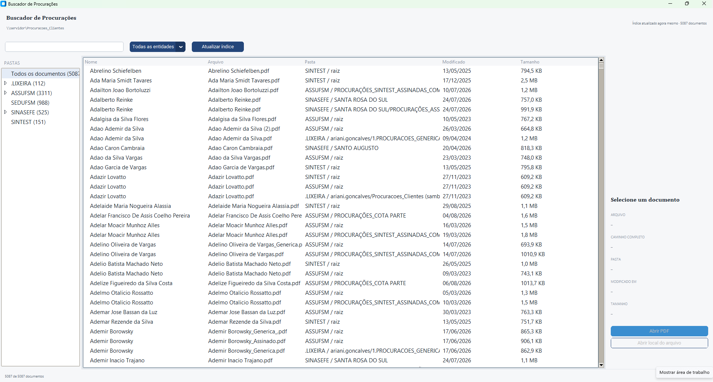

# Manual do Usuário — Buscador de Procurações

**Versão do programa:** 0.1.0  
**Manual gerado em:** 13/08/2026
*Commit: não registrado — a pasta do projeto não era um repositório git no momento da geração deste guia.*

Este guia é para quem **usa** o Buscador de Procurações no dia a dia: localizar a procuração
de uma pessoa e abrir o PDF. Você não precisa saber programar nem instalar nada além do
programa.

---

## Sumário

1. [O que o Buscador de Procurações faz](#1-o-que-o-buscador-de-procurações-faz)
2. [Antes de começar](#2-antes-de-começar)
3. [Primeiros passos: encontrar uma procuração](#3-primeiros-passos-encontrar-uma-procuração)
4. [Conhecendo a tela](#4-conhecendo-a-tela)
5. [Buscar pelo nome da pessoa](#5-buscar-pelo-nome-da-pessoa)
6. [Entender por que a mesma pessoa aparece mais de uma vez](#6-entender-por-que-a-mesma-pessoa-aparece-mais-de-uma-vez)
7. [Filtrar por entidade (sindicato)](#7-filtrar-por-entidade-sindicato)
8. [Navegar pelas pastas e cidades](#8-navegar-pelas-pastas-e-cidades)
9. [Ordenar a lista de resultados](#9-ordenar-a-lista-de-resultados)
10. [Conferir o documento antes de abrir](#10-conferir-o-documento-antes-de-abrir)
11. [Abrir o PDF](#11-abrir-o-pdf)
12. [Abrir a pasta do arquivo no Explorador](#12-abrir-a-pasta-do-arquivo-no-explorador)
13. [Atualizar o índice quando há documentos novos](#13-atualizar-o-índice-quando-há-documentos-novos)
14. [O que o buscador não encontra](#14-o-que-o-buscador-não-encontra)
15. [Problemas frequentes](#15-problemas-frequentes)
16. [Onde o programa guarda seus dados](#16-onde-o-programa-guarda-seus-dados)
17. [Glossário](#17-glossário)

---

## 1. O que o Buscador de Procurações faz

O programa lê a pasta de rede onde ficam as procurações digitalizadas dos clientes e monta
uma lista pesquisável de todos os PDFs encontrados. Com ele você:

- digita o nome de uma pessoa e vê **todas** as procurações dela, de qualquer entidade;
- vê a primeira página do documento **dentro do programa**, antes de abrir;
- abre o PDF no leitor de PDF do seu computador com um duplo clique;
- abre a pasta do arquivo no Explorador do Windows, quando precisa copiar ou anexar o arquivo.

A pasta de rede padrão é `\\servidor\Procuracoes_Clientes`. O caminho aparece escrito no
canto superior esquerdo da janela, embaixo do título — é assim que você confere qual
repositório está sendo consultado.

**O programa nunca altera, move ou apaga os arquivos do servidor.** Ele só lê.

---

## 2. Antes de começar

Confira estes três pontos **antes** de abrir o programa. Todos os passos deste guia dependem
deles:

| Requisito | Como conferir |
|---|---|
| Windows | O programa é distribuído como um arquivo `.exe` para Windows. |
| Acesso à pasta de rede | Abra o Explorador de Arquivos, cole `\\servidor\Procuracoes_Clientes` na barra de endereço e pressione Enter. Se as pastas das entidades aparecerem, você tem acesso. |
| O arquivo `BuscadorProcuracoes.exe` | É um arquivo único, sem instalação. Você pode deixá-lo na Área de Trabalho ou em uma pasta sua. |

> Sistema disponibilizado pelo núcleo de Tecnologia: `BuscadorProcuracoes.exe`

Um leitor de PDF (Adobe Reader, Edge, ou qualquer outro) precisa estar configurado como
programa padrão para arquivos `.pdf` — é ele que o Buscador aciona quando você manda abrir
um documento.


---

## 3. Primeiros passos: encontrar uma procuração

Siga estes cinco passos e você chega a um PDF aberto na tela.

1. **Dê um duplo clique em `BuscadorProcuracoes.exe`.**
   Abre uma janela chamada **Buscador de Procurações**.

2. **Na primeira vez, espere o programa ler a pasta de rede.**
   No canto superior direito aparece `Atualizando índice…` e depois
   `Indexando… 50 arquivos`, `Indexando… 100 arquivos`, e assim por diante — o número sobe
   conforme a leitura avança. Enquanto isso, o botão **Atualizar índice** fica desabilitado e
   escrito `Atualizando…`.

   Quando termina, o texto muda para algo como
   `Índice atualizado agora mesmo · 4949 documentos`, a lista central se preenche e o botão
   volta a ficar clicável.

   > Esta leitura completa acontece **só na primeira vez** que você abre o programa (ou quando
   > você clica em **Atualizar índice**). Nas próximas vezes, o programa abre já com a lista
   > pronta, em segundos.

3. **Clique no campo de busca** (o campo com o texto claro
   `Buscar por nome da pessoa ou arquivo…`) **e digite parte do nome da pessoa.**
   A lista filtra sozinha enquanto você digita — não pressione Enter, não há botão de buscar.

4. **Clique uma vez na linha da pessoa.**
   O painel da direita mostra `Carregando pré-visualização…` e, em seguida, a imagem da
   primeira página do documento, junto com o nome do arquivo, o caminho completo, a pasta, a
   data de modificação e o tamanho.

5. **Dê um duplo clique na linha** (ou clique no botão azul **Abrir PDF**, no painel da direita).
   O documento abre no seu leitor de PDF.

Pronto — esse é o fluxo completo do dia a dia. O resto do guia detalha cada parte.

> # 

---

## 4. Conhecendo a tela

A janela tem cinco áreas. Elas aparecem sempre nas mesmas posições.

> 📷 ![(tela.png)]

**1. Cabeçalho (faixa do topo)**
À esquerda, o título **Buscador de Procurações** e, embaixo dele, o caminho da pasta de rede
que está sendo consultada. À direita, a situação do índice — por exemplo
`Índice atualizado há 2 h · 4949 documentos`.

**2. Barra de ferramentas (logo abaixo do cabeçalho)**
Da esquerda para a direita:
- o **campo de busca**;
- a lista suspensa de entidades, que começa em **Todas as entidades**;
- o botão **Atualizar índice**.

**3. Barra lateral esquerda — PASTAS**
Uma árvore de pastas montada a partir do que foi encontrado no servidor. O primeiro item é
**Todos os documentos**, seguido de uma linha por entidade. Cada linha mostra a quantidade de
documentos entre parênteses.

**4. Lista de resultados (área central)**
Uma linha por documento, com cinco colunas:

| Coluna | O que mostra |
|---|---|
| **Nome** | O nome da pessoa, extraído do nome do arquivo (sem os sufixos como `_Original` ou ` (2)`). |
| **Arquivo** | O nome do arquivo como está no servidor, com extensão e sufixos. |
| **Pasta** | A entidade e a subpasta, no formato `SINASEFE / ALEGRETE`. Quando o arquivo está solto na pasta da entidade, aparece `SINASEFE / raiz`. |
| **Modificado** | A data de modificação do arquivo, no formato `dd/mm/aaaa`. |
| **Tamanho** | O tamanho do arquivo, por exemplo `842,0 KB` ou `1,2 MB`. |

**5. Painel de detalhes (direita)**
Mostra a primeira página do documento selecionado e os dados dele: **ARQUIVO**,
**CAMINHO COMPLETO**, **PASTA**, **MODIFICADO EM** e **TAMANHO**. Embaixo, os dois botões de
ação: **Abrir PDF** e **Abrir local do arquivo**.

Enquanto nenhuma linha está selecionada, o painel mostra **Selecione um documento**, os campos
ficam com traços (`—`) e os dois botões ficam desabilitados.

**Rodapé**
No canto inferior esquerdo, a contagem `12 de 4949 documentos`: o primeiro número é quanto
está aparecendo na lista agora, o segundo é o total indexado.

---

## 5. Buscar pelo nome da pessoa

1. Clique no campo de busca.
2. Digite parte do nome. A lista se atualiza depois de uma pausa muito curta na digitação.
3. Confira a contagem no rodapé para saber quantos documentos correspondem.

**O que a busca considera:** o nome da pessoa **e** o nome do arquivo. Nada além disso.

Três facilidades que vale conhecer:

**Acentos não importam.** Digitar `joao` encontra `João`. Digitar `JOAO` encontra a mesma
coisa — maiúsculas e minúsculas também são ignoradas.

**Você pode buscar por qualquer pedaço do nome.** Digitar `silva` traz todas as pessoas com
"Silva" em qualquer posição do nome, não só as que começam com Silva.

**Erros pequenos de digitação são tolerados.** Se a sua busca não encontrar nada e o termo
tiver **3 letras ou mais**, o programa refaz a busca de forma aproximada e mostra os nomes
mais parecidos. Assim, `Gonçalvez` ainda encontra `Gonçalves`.

> Essa tolerância a erro só entra em ação quando a busca exata devolve **zero** resultados. Se
> a sua busca encontrou pelo menos um documento, a lista mostra só as correspondências exatas.

**Dica:** como o nome do arquivo também é pesquisado, você pode buscar pelos sufixos. Digitar
`original` traz os arquivos terminados em `_Original`; digitar `assinada` traz os
`_Assinada`.

**Para limpar a busca**, apague o conteúdo do campo. A lista volta a mostrar tudo que estiver
dentro do filtro de pasta ativo (veja as seções 7 e 8).

---

## 6. Entender por que a mesma pessoa aparece mais de uma vez

É comum. Uma mesma pessoa costuma ter mais de um PDF no servidor: uma cópia duplicada, uma
versão original, uma versão assinada.

A coluna **Nome** mostra o nome da pessoa já **sem** esses sufixos — por isso várias linhas
podem exibir exatamente o mesmo nome. Para distinguir uma da outra, olhe as outras colunas:

| Nome | Arquivo | Pasta | Modificado |
|---|---|---|---|
| MARIA SILVA | MARIA SILVA.pdf | ASSUFSM / raiz | 14/03/2024 |
| MARIA SILVA | MARIA SILVA_Original.pdf | ASSUFSM / raiz | 14/03/2024 |
| MARIA SILVA | MARIA SILVA (2).pdf | ASSUFSM / PROCURAÇÕES_COTA PARTE | 02/09/2025 |

*(exemplo ilustrativo do formato das linhas)*

Sufixos que aparecem com frequência no repositório e o que costumam indicar:

| Sufixo no arquivo | Significado provável |
|---|---|
| `(2)`, `(3)`, `(4)` | Cópia ou versão duplicada |
| `_Generica` / `_Generico` | Procuração genérica |
| `_Original` | Versão original |
| `_1`, `_2` | Versão numerada |
| `_Assinada` / `_Assinado` / `_assinatura eletronica` | Documento já assinado |
| `_especifica` | Procuração específica, não genérica |

Quando houver dúvida sobre qual é o documento certo, use a **pré-visualização** (seção 10)
para olhar a primeira página de cada um antes de abrir.

> Os significados acima são a interpretação registrada no levantamento do repositório, não uma
> regra formal do escritório. Em caso de dúvida sobre qual versão vale, confirme com a equipe
> responsável pelo arquivo.

---

## 7. Filtrar por entidade (sindicato)

As procurações estão organizadas por entidade. O programa mostra cada uma por uma sigla curta:
**ASSUFSM**, **SEDUFSM**, **SINASEFE** e **SINTEST**.

Para ver só os documentos de uma entidade:

1. Clique na lista suspensa que mostra **Todas as entidades**, na barra de ferramentas.
2. Escolha a sigla desejada. A lista central e a contagem do rodapé se ajustam na hora.

Para voltar a ver tudo, escolha **Todas as entidades** na mesma lista.

**Atenção:** o filtro de entidade **continua ativo** enquanto você digita no campo de busca.
Se uma pessoa que você tem certeza que existe não aparece, confira se há uma entidade
selecionada — uma busca dentro de `SINTEST` não encontra um documento que está em `ASSUFSM`.

---

## 8. Navegar pelas pastas e cidades

A barra lateral **PASTAS** reproduz a organização real do servidor e serve para quem prefere
navegar em vez de digitar.

- **Todos os documentos (N)** — remove qualquer filtro de pasta e mostra o repositório inteiro.
- **Uma linha por entidade**, com a contagem de documentos.
- Entidades que têm subpastas mostram uma **seta para expandir**. Clique na seta para ver as
  subpastas — no caso do SINASEFE, elas são as cidades/subseções (ALEGRETE, RIO DO SUL,
  SANTA MARIA e assim por diante).
- Dentro de uma entidade com subpastas, a linha **Procurações (raiz)** reúne os arquivos que
  estão soltos na pasta da entidade, fora de qualquer subpasta.

Clique em qualquer linha da árvore para filtrar a lista central por ela. A lista suspensa de
entidades acompanha a sua escolha automaticamente.

Dois detalhes do comportamento:

- Entidades cujos arquivos estão todos soltos na pasta principal (é o caso de SEDUFSM e
  SINTEST) **não expandem** — não há subpasta para mostrar.
- Quando uma subpasta tem outras subpastas dentro dela (como SANTA ROSA DO SUL, no SINASEFE),
  clicar nela traz **também** os documentos das pastas de dentro. A árvore não desce mais que
  um nível, para não ficar longa demais.

Para voltar ao repositório inteiro, clique em **Todos os documentos**.

---

## 9. Ordenar a lista de resultados

Clique no **título de uma coluna** para ordenar por ela. Clique no mesmo título de novo para
inverter a ordem (crescente ↔ decrescente).

As colunas que respondem ao clique são **Arquivo**, **Pasta**, **Modificado** e **Tamanho**.

Usos comuns:
- **Modificado** — para achar as procurações mais recentes de uma pessoa.
- **Pasta** — para agrupar os resultados por entidade e subpasta.
- **Tamanho** — para localizar um arquivo grande ou anormalmente pequeno.

Sem nenhum clique, a lista vem em ordem alfabética pelo nome da pessoa.

> A coluna **Nome** não responde ao clique nesta versão. E, nesta versão, clicar em **Arquivo**
> ordena pelo **nome da pessoa**, não pelo nome do arquivo — os dois quase sempre coincidem na
> prática, mas arquivos da mesma pessoa com sufixos diferentes não ficam necessariamente em
> ordem alfabética entre si.

---

## 10. Conferir o documento antes de abrir

As procurações são documentos **digitalizados** — imagens de papel escaneado. A única forma de
saber o que tem dentro de um arquivo é olhar a página.

1. Clique uma vez na linha do documento na lista central.
2. O painel da direita mostra `Carregando pré-visualização…` por um instante.
3. A **primeira página** do PDF aparece como imagem, junto com os dados do arquivo.

Você pode clicar de uma linha para outra livremente: o painel sempre mostra o documento da
linha selecionada no momento, mesmo que uma pré-visualização anterior ainda estivesse
carregando.

**A pré-visualização mostra só a primeira página.** Para ver as demais, abra o PDF (seção 11).

Se o painel mostrar **Pré-visualização indisponível** ou uma mensagem de erro no lugar da
imagem, veja a seção 15 — o documento pode estar corrompido ou protegido por senha. Os botões
**Abrir PDF** e **Abrir local do arquivo** continuam funcionando mesmo assim.

Quando você digita uma nova busca ou muda um filtro, a seleção é desfeita e o painel volta para
**Selecione um documento**. Isso é o comportamento normal: selecione uma linha da nova lista
para ver os detalhes de novo.

---

## 11. Abrir o PDF

Três caminhos levam ao mesmo lugar. Use o que for mais confortável:

- **Duplo clique** na linha da lista central.
- Selecione a linha e clique no botão azul **Abrir PDF**, no painel da direita.
- Clique com o **botão direito** na linha e escolha **Abrir PDF** no menu.

O documento abre no programa que o seu Windows usa para arquivos PDF. O Buscador continua
aberto atrás — você pode voltar para ele e abrir outro documento sem fechar nada.

---

## 12. Abrir a pasta do arquivo no Explorador

Use quando precisar copiar o arquivo, anexá-lo a um e-mail ou conferir o que mais existe na
mesma pasta.

- Selecione a linha e clique em **Abrir local do arquivo**, no painel da direita; **ou**
- clique com o **botão direito** na linha e escolha **Abrir local do arquivo**.

O Explorador de Arquivos abre na pasta do servidor **com o arquivo já selecionado**, pronto para
você copiar com Ctrl+C.

---

## 13. Atualizar o índice quando há documentos novos

O programa não fica vigiando a pasta de rede. Ele trabalha com uma cópia da **lista de
arquivos** feita na última leitura — é isso que deixa a busca instantânea mesmo com milhares
de documentos.

Consequência prática: **uma procuração digitalizada hoje não aparece até você mandar
atualizar.**

**Quando atualizar:**
- quando alguém avisar que digitalizou documentos novos;
- quando você procura uma pessoa que sabe que foi cadastrada recentemente e não encontra;
- quando o cabeçalho mostrar uma data antiga em `Índice atualizado …`.

**Como atualizar:**

1. Clique no botão **Atualizar índice**, na barra de ferramentas.
2. O botão fica desabilitado e escrito `Atualizando…`; o canto superior direito mostra o
   progresso: `Indexando… 250 arquivos`, `Indexando… 300 arquivos`…
3. Quando termina, o botão volta ao normal, a lista se recarrega e o cabeçalho mostra
   `Índice atualizado agora mesmo · N documentos`.

Durante a atualização a janela continua respondendo — a leitura roda em segundo plano.

A leitura percorre a pasta de rede inteira e pode levar alguns minutos, dependendo da
velocidade da rede e da quantidade de arquivos. O indicador de progresso avança de 50 em 50
arquivos, então é normal ele "pular" números.

> ⚠️ [VERIFICAR: o repositório não registra quanto tempo a varredura completa leva na rede real.
> Meça uma vez em uso normal e anote o tempo aproximado aqui, para os usuários saberem o que
> esperar.]

O texto do cabeçalho vira `Índice atualizado há 4 min`, `há 2 h` ou, passado um dia,
`Índice atualizado em 06/08/2026 15:30`.

---

## 14. O que o buscador não encontra

Vale conhecer os limites desta versão antes de concluir que um documento não existe.

**Não busca dentro do texto do documento.** As procurações são digitalizações — imagens, sem
texto que o computador consiga ler. Buscar por um CPF, por um número de processo ou por uma
frase que está escrita no papel **não funciona**. A busca é pelo nome da pessoa e pelo nome do
arquivo.

**Não busca pelo nome da pasta.** Digitar `ALEGRETE` no campo de busca não traz os documentos
da subseção de Alegrete. Para chegar neles, use a barra lateral **PASTAS** (seção 8).

**Não mostra documentos adicionados depois da última atualização do índice.** Veja a seção 13.

**Não encontra o que está fora da pasta configurada.** O programa lê apenas
`\\servidor\Procuracoes_Clientes` (ou o caminho que estiver configurado — veja a seção 16) e
todas as pastas dentro dela. Documentos guardados em outro lugar são invisíveis para ele.

**Só considera arquivos `.pdf`.** Documentos em Word, imagens soltas (JPG, PNG) ou arquivos de
sistema não entram na lista.

---

## 15. Problemas frequentes

Os títulos abaixo reproduzem as mensagens exatas que o programa mostra. Use Ctrl+F para achar
a sua.

### "Não foi possível acessar o repositório em: \\servidor\Procuracoes_Clientes"

A mensagem completa, numa janela chamada **Repositório indisponível**, é:

```
Não foi possível acessar o repositório em:
\\servidor\Procuracoes_Clientes

Verifique a conexão de rede e se o caminho está correto.
```

**Causa:** o programa tentou ler a pasta de rede e ela não respondeu — servidor fora do ar, você
está sem conexão com a rede da empresa (fora do escritório, sem VPN), ou o caminho configurado
está errado.

**Solução:**
1. Clique em **OK** para fechar o aviso.
2. Abra o Explorador de Arquivos, cole `\\servidor\Procuracoes_Clientes` na barra de endereço e
   pressione Enter.
   - Se o Explorador também não abrir a pasta, o problema é de rede ou de permissão: procure o
     suporte de TI.
   - Se o Explorador abrir normalmente, clique em **Atualizar índice** no programa e tente de novo.
3. Se você está fora do escritório, conecte-se à VPN antes de tentar.

**Boa notícia:** se você já tinha um índice de uma leitura anterior, ele **continua funcionando**.
Você segue buscando e vendo os dados dos documentos normalmente — só não consegue abrir os PDFs
(que estão no servidor) nem trazer documentos novos até a rede voltar.

### O cabeçalho mostra "Falha ao atualizar índice"

**Causa:** a leitura da pasta de rede falhou e **não havia** nenhum índice anterior — normalmente
é a primeira vez que o programa é aberto, sem acesso à rede.

**Solução:** resolva o acesso à pasta (item anterior) e clique em **Atualizar índice**. Sem uma
primeira leitura bem-sucedida, a lista fica vazia.

### "O arquivo não foi encontrado (pode ter sido movido ou removido)"

A mensagem aparece numa janela chamada **Não foi possível abrir o arquivo** (ou
**Não foi possível abrir a pasta**, se você clicou em "Abrir local do arquivo"), seguida do
caminho completo do documento.

**Causa:** o arquivo estava no servidor quando o índice foi montado, mas foi movido, renomeado
ou apagado depois. O programa está mostrando uma informação desatualizada.

**Solução:** clique em **Atualizar índice** para refazer a leitura. O documento sai da lista se
tiver sido removido, ou reaparece na pasta nova se tiver sido movido.

### "Não foi possível gerar a pré-visualização." ou "Pré-visualização indisponível"

**Causa:** o programa não conseguiu ler a primeira página do PDF. Costuma acontecer com arquivos
corrompidos, protegidos por senha, ou quando a rede oscila no momento da leitura.

**Solução:**
1. Clique em outra linha e volte para esta — a pré-visualização é gerada de novo.
2. Se continuar falhando, clique em **Abrir PDF**. Muitas vezes o documento abre normalmente no
   leitor de PDF mesmo sem a pré-visualização.
3. Se nem o leitor de PDF abrir, o arquivo provavelmente está danificado no servidor: avise a
   equipe responsável para redigitalizar.

### "O PDF não contém páginas."

**Causa:** o arquivo é um PDF vazio — em geral, uma digitalização que falhou e foi salva mesmo assim.

**Solução:** o arquivo precisa ser digitalizado de novo. Avise a equipe responsável pelo documento.

### A pessoa existe, mas não aparece na busca

Verifique nesta ordem:

1. **Há um filtro ativo?** Olhe a lista suspensa de entidades e a barra lateral. Clique em
   **Todos os documentos** na barra lateral para limpar os filtros e busque de novo.
2. **O documento é recente?** Clique em **Atualizar índice** (seção 13).
3. **O nome está escrito de outro jeito no arquivo?** Tente só o primeiro nome, ou só o
   sobrenome. Nomes compostos e abreviações (`MARIA J. SILVA`) variam muito no repositório.
4. **Você está buscando por algo que não é o nome?** CPF, matrícula e número de processo não
   são pesquisáveis (seção 14).

### A janela demora a abrir na primeira vez

É esperado: na primeira execução o programa lê a pasta de rede inteira antes de conseguir
mostrar resultados. Acompanhe o contador `Indexando… N arquivos` no canto superior direito.
Nas próximas vezes a abertura é rápida.

### O texto de alguns botões está difícil de ler

Foi corrigido na versão de 07/08/2026. Se você ainda vê botões com texto sem contraste,
está com uma cópia antiga do programa — peça a versão atual do `BuscadorProcuracoes.exe`.

---

## 16. Onde o programa guarda seus dados

O programa não guarda nada junto com o `.exe`. Ele usa uma pasta pessoal no seu perfil do
Windows:

```
%APPDATA%\BuscadorProcuracoes
```

Para chegar lá, pressione **Windows+R**, cole `%APPDATA%\BuscadorProcuracoes` e pressione Enter.

| Arquivo | Para que serve |
|---|---|
| `config.json` | Guarda o caminho da pasta de rede, no campo `root_path`. |
| `indice.db` | A lista de documentos lida na última atualização. É o que torna a busca instantânea. |

**Se a pasta de rede mudar de endereço**, o caminho precisa ser corrigido dentro do
`config.json` — nesta versão ainda não existe uma tela no programa para isso. Peça ajuda ao
suporte de TI: o arquivo tem este formato, e o valor a trocar é o do `root_path`.

```json
{
  "root_path": "\\\\servidor\\Procuracoes_Clientes"
}
```

Feche o programa antes de editar o arquivo e abra-o de novo depois. Na primeira abertura com o
caminho novo, clique em **Atualizar índice**.

**Se a lista de documentos ficar visivelmente errada** (documentos que não existem mais, ou
resultados estranhos), você pode apagar o arquivo `indice.db` com o programa fechado. Na
próxima abertura o programa refaz a leitura completa do zero. Nada é perdido: o `indice.db` é
apenas uma cópia da lista, e os PDFs continuam intactos no servidor.

---

## 17. Glossário

**Procuração** — o documento assinado pelo cliente que autoriza o escritório a representá-lo.
Aqui, sempre um PDF digitalizado.

**Entidade** — o sindicato ou associação a que o cliente é filiado. No repositório são quatro:
ASSUFSM, SEDUFSM, SINASEFE e SINTEST. Cada uma tem sua pasta no servidor.

**Subseção** — a divisão do SINASEFE por cidade (ALEGRETE, RIO DO SUL, SANTA MARIA e outras).
No programa, aparecem como subpastas dentro do SINASEFE.

**Índice** — a lista de documentos que o programa monta ao ler a pasta de rede e guarda no seu
computador. É nela que a busca acontece, e é por isso que digitar no campo de busca é
instantâneo. O índice guarda **nomes e datas dos arquivos**, não os PDFs em si.

**Indexar / Atualizar índice** — refazer a leitura da pasta de rede para que o programa saiba
dos documentos novos.

**Pré-visualização** — a imagem da primeira página do documento, mostrada no painel direito sem
precisar abrir o PDF.

**PDF digitalizado** — um PDF que contém a foto de um papel escaneado, e não texto. É o motivo
de não ser possível buscar pelo conteúdo escrito nos documentos.

**Raiz** — a pasta principal de uma entidade, sem subpastas. Um documento marcado como
`SINTEST / raiz` está solto na pasta do SINTEST.

---

*Guia baseado na versão 0.1.0 do Buscador de Procurações. Se um botão ou mensagem não
corresponder ao que você vê na tela, o programa foi atualizado depois deste guia — avise a
equipe responsável.*
