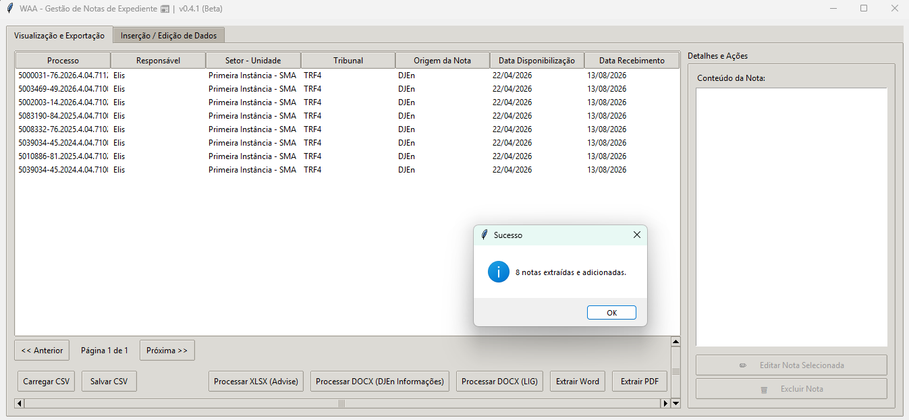
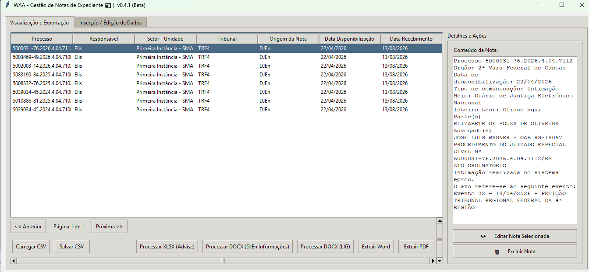

# Manual do Usuário — WAA · Gestão de Notas de Expediente

**Versão do programa:** v0.5
**Data deste manual:** 13/08/2026
**Commit de referência:** `f831267` 

---

## Sumário

1. [Para que serve o programa](#1-para-que-serve-o-programa)
2. [Antes de começar](#2-antes-de-começar)
3. [Abrindo o programa pela primeira vez](#3-abrindo-o-programa-pela-primeira-vez)
4. [Tour da tela](#4-tour-da-tela)
5. [Importar notas do DJEn Informações (arquivo Word)](#5-importar-notas-do-djen-informações-arquivo-word)
6. [Importar publicações do LIG (arquivos Word)](#6-importar-publicações-do-lig-arquivos-word)
7. [Importar notas do Advise (planilhas Excel)](#7-importar-notas-do-advise-planilhas-excel)
8. [Cadastrar uma nota manualmente](#8-cadastrar-uma-nota-manualmente)
9. [Ler, editar e excluir uma nota](#9-ler-editar-e-excluir-uma-nota)
10. [Salvar e recuperar seu trabalho (arquivo CSV)](#10-salvar-e-recuperar-seu-trabalho-arquivo-csv)
11. [Gerar o documento de conferência em Word ou PDF](#11-gerar-o-documento-de-conferência-em-word-ou-pdf)
12. [Fechar o programa sem perder dados](#12-fechar-o-programa-sem-perder-dados)
13. [Problemas frequentes](#13-problemas-frequentes)
14. [Limites conhecidos desta versão](#14-limites-conhecidos-desta-versão)
15. [Glossário](#15-glossário)

---

## 1. Para que serve o programa

O programa reúne, em uma única lista, as notas de expediente que chegam ao escritório por três caminhos diferentes — **DJEn Informações**, **LIG** e **Advise** — e transforma essa lista em um documento de conferência (Word ou PDF), separado por responsável, com uma coluna de **Rubrica** para assinatura.

O ciclo de trabalho normal é este:

1. Você importa os arquivos que recebeu (Word ou Excel), ou digita as notas à mão.
2. Confere e corrige a lista na tela.
3. Salva a lista em um arquivo `.csv`, para poder continuar depois.
4. Gera o Word ou o PDF com o resumo de processos por responsável.

Quem usa: as pessoas responsáveis pelo controle de expediente. A lista de responsáveis já vem pré-cadastrada no programa:

| Responsável | Setor - Unidade |
|---|---|
| Elis | Primeira Instância - SMA |
| Tanise | Primeira Instância - SMA |
| Vanessa | Tribunais - SMA |
| Luciana | Consultivo - SMA |
| Lilia | Cumprimento de Sentença - SMA |
| Luiz | Gerência - BSB |

Essa lista é fixa no programa. Para incluir ou alterar um nome, solicite ao Núcleo de Tecnologia — a mudança chega em uma nova versão do programa.

---

## 2. Antes de começar

O programa é entregue pelo **Núcleo de Tecnologia** como um arquivo executável, pronto para uso. Você **não precisa instalar nada**: não há instalação de programas auxiliares nem configuração inicial.

O que você precisa ter em mãos:

| Item | Observação |
|---|---|
| O arquivo do programa | Fornecido pelo Núcleo de Tecnologia |
| Um computador com Windows | O programa foi feito para Windows |
| Uma pasta sua para os arquivos de trabalho | É onde você vai salvar os `.csv` e os documentos gerados |

> Sugestão: crie uma pasta como `Documentos\Notas de Expediente` antes de começar. Você vai voltar a ela toda vez que salvar ou abrir uma lista.

---

## 3. Abrindo o programa pela primeira vez

1. Localize o arquivo do programa no local indicado pelo Núcleo de Tecnologia.
2. Dê **duplo clique** no arquivo.
3. Aguarde alguns segundos. A primeira abertura costuma demorar um pouco mais que as seguintes.
4. A janela **WAA - Gestão de Notas de Expediente** aparece, já na aba **Visualização e Exportação**, com a tabela vazia e a indicação **"Página 1 de 1"**.

> A versão do programa aparece no título da janela, ao lado do nome. Informe esse número sempre que abrir um chamado.

Se a janela não abrir, ou se o Windows exibir um aviso de segurança ao executar o arquivo, acione o Núcleo de Tecnologia — veja [Problemas frequentes](#13-problemas-frequentes).

>  

---

## 4. Tour da tela

O programa tem duas abas, no topo da janela.

### Aba "Visualização e Exportação"

É onde você passa a maior parte do tempo. Ela tem três áreas:

**A tabela (esquerda).** Mostra as notas já carregadas, **10 por página**, com as colunas: Processo, Responsável, Setor - Unidade, Tribunal, Origem da Nota, Data Disponibilização e Data Recebimento.

> As linhas com **fundo rosa** são notas em que a Data de Disponibilização ficou vazia ou saiu como "Não encontrada" na importação. Elas precisam de conferência manual.
>
> O texto completo da nota **não aparece na tabela** — ele fica no painel da direita, quando você clica na linha.

**Os botões abaixo da tabela.**

| Botão | O que faz |
|---|---|
| `<< Anterior` / `Próxima >>` | Muda de página. O texto "Página X de Y" fica entre os dois. |
| `Carregar CSV` | Abre uma lista salva anteriormente |
| `Salvar CSV` | Guarda a lista atual em um arquivo |
| `Processar XLSX (Advise)` | Importa planilhas do Advise |
| `Processar DOCX (DJEn Informações)` | Importa um Word do DJEn |
| `Processar DOCX (LIG)` | Importa um ou mais Word do LIG |
| `Extrair Word` | Gera o documento de conferência em Word |
| `Extrair PDF` | Gera o documento de conferência em PDF |

**O painel "Detalhes e Ações" (direita).** Mostra o **Conteúdo da Nota** da linha selecionada e traz os botões **✏️ Editar Nota Selecionada** e **🗑️ Excluir Nota**. Os dois botões ficam apagados (desativados) enquanto nenhuma linha estiver selecionada.

> 

### Aba "Inserção / Edição de Dados"

Usada para digitar uma nota nova ou corrigir uma existente. À esquerda fica o campo grande **Conteúdo**; à direita, o quadro **Detalhes do Processo** com os campos Responsável, Setor - Unidade, Processo Nº, Tribunal, Origem da Nota, Data Disponibilização e Data Recebimento, além do botão de gravação.

> 📷 [CAPTURA NECESSÁRIA: aba "Inserção / Edição de Dados" vazia, mostrando o campo Conteúdo à esquerda e o quadro Detalhes do Processo à direita.]

---

## 5. Importar notas do DJEn Informações (arquivo Word)

Use quando receber o arquivo `.docx` com as notas do DJEn. **Um arquivo por vez.**

1. Na aba **Visualização e Exportação**, clique em **Processar DOCX (DJEn Informações)**.
2. Na janela "Selecione o arquivo DOCX", escolha o arquivo `.docx` e clique em Abrir.
3. A janela **Processar DOCX** aparece. Preencha:
   - **Responsável** — obrigatório. Já vem com o primeiro nome da lista selecionado; troque se for outro.
   - **Setor - Unidade** — preenchido sozinho a partir do responsável. Não é editável.
   - **Tribunal** — obrigatório. Escolha na lista.
   - **Data Recebimento** — já vem com a data de hoje. Altere se necessário.
4. Clique em **Processar e Carregar**.
5. A mensagem **"N notas extraídas e adicionadas."** confirma o resultado, e o programa volta para a aba da tabela, já na última página.

**O que o programa procura dentro do arquivo:** cada nota começa em uma linha que comece com a palavra `Processo` seguida do número. A data vem da linha `Data de disponibilização:`. Quando você escolhe o tribunal **STJ**, o programa também lê a tabela que vem logo abaixo de cada nota e usa o número do recurso (por exemplo, `AREsp 3010209/PE`) no lugar do número do processo.

Se nenhuma nota for reconhecida, aparece **"Nenhuma nota encontrada no documento selecionado."** e nada é adicionado.

> ℹ️ As notas importadas **somam-se** às que já estão na lista; elas não substituem nada.

---

## 6. Importar publicações do LIG (arquivos Word)

Use para os arquivos `.docx` vindos do LIG. Aqui você pode selecionar **vários arquivos de uma vez**.

1. Clique em **Processar DOCX (LIG)**.
2. Na janela "Selecione arquivos DOCX (LIG)", selecione um ou mais arquivos (segure Ctrl para marcar vários) e clique em Abrir.
3. Na janela **Processar DOCX (LIG) - Parâmetros**, preencha Responsável (obrigatório), Tribunal e Data Recebimento.

   > Diferente da importação do DJEn, aqui o **Tribunal não é obrigatório** — se você deixar em branco, as notas entram sem tribunal. Preencha assim mesmo, para o documento final sair completo.

4. Clique em **Processar e Carregar**.
5. A mensagem **"N publicações extraídas e adicionadas."** confirma o resultado.

**O que o programa procura dentro do arquivo:** o programa lê **apenas a primeira tabela** do documento. Dentro dela, cada publicação começa em uma célula com o texto `Publicação 1 de 5` (ou equivalente). O número do processo vem de um trecho `Processo: ...` e a data, de um trecho `Data da Publicação` que contenha uma data no formato `dd/mm/aaaa`.

Se nada for reconhecido, aparece **"Nenhuma publicação encontrada nos arquivos selecionados."**

---

## 7. Importar notas do Advise (planilhas Excel)

Use para os arquivos `.xlsx` exportados do Advise. Também aceita **vários arquivos de uma vez**.

1. Clique em **Processar XLSX (Advise)**.
2. Selecione um ou mais arquivos `.xlsx` e clique em Abrir.
3. A janela **Processar XLSX (Advise) - Parâmetros** aparece. Preencha:
   - **Responsável** — obrigatório.
   - **Tribunal** — obrigatório.
   - **Data Recebimento** — já vem com a data de hoje.
   - Na lista de baixo, o programa mostra cada arquivo e as **abas (planilhas)** de cada um, todas marcadas. **Desmarque as que não quiser importar.** Pelo menos uma precisa ficar marcada.
4. Clique em **Processar e Carregar**.
5. A mensagem **"N registros importados de Advise."** confirma o resultado.

**O que o programa procura dentro da planilha:** nas **10 primeiras linhas**, ele localiza a linha de cabeçalho que contenha `PROCESSO` ou `DISPONIBILIZA`. A partir dali, cada linha preenchida vira uma nota: a coluna com `PROCESSO` no nome vira o número do processo, a coluna com `DISPONIBIL` no nome vira a Data de Disponibilização, e o **Conteúdo** é o conjunto de todas as células daquela linha, uma embaixo da outra. A Origem da Nota é sempre gravada como `Advise`.

Quando não encontrar a coluna de disponibilização, a data fica como **"Não encontrada"** e a linha aparece em rosa na tabela.

Se nada for encontrado, aparece **"Nenhuma nota encontrada nas planilhas selecionadas."**

---

## 8. Cadastrar uma nota manualmente

1. Abra a aba **Inserção / Edição de Dados**.
2. Cole ou digite o texto da nota no campo **Conteúdo**, à esquerda.
3. No quadro **Detalhes do Processo**, preencha:
   - **Responsável** — obrigatório. Ao escolher, o campo **Setor - Unidade** se preenche sozinho.
   - **Processo Nº** — obrigatório.
   - **Tribunal** — escolha na lista.
   - **Origem da Nota** — a lista sugere `DJEn`, `LIG` e `Advise`, mas este campo aceita texto digitado, se precisar de outra origem.
   - **Data Disponibilização** e **Data Recebimento** — clique no campo para abrir o calendário. O formato é `dd/mm/aaaa`.
4. Clique em **Adicionar Processo à Lista**.
5. A mensagem **"Processo adicionado com sucesso!"** aparece, os campos são limpos e o programa muda sozinho para a aba da tabela, na última página.

Se faltar responsável, aparece o aviso **"Selecione um Responsável antes de continuar."**. Se faltar o número do processo, aparece **"O campo Processo é obrigatório."**

---

## 9. Ler, editar e excluir uma nota

### Ler o texto completo

Na aba **Visualização e Exportação**, clique na linha desejada. O texto integral aparece no painel **Conteúdo da Nota**, à direita. Esse painel é somente leitura.

### Editar

1. Clique na linha que quer corrigir.
2. Clique em **✏️ Editar Nota Selecionada**.
3. O programa muda para a aba **Inserção / Edição de Dados** com todos os campos já preenchidos, e o botão de gravação passa a se chamar **Salvar Alterações**.
4. Faça as correções e clique em **Salvar Alterações**.
5. A mensagem **"Registro atualizado com sucesso!"** confirma a alteração.

> Se você abrir uma nota para edição e mudar de ideia, troque de aba sem clicar em Salvar Alterações: nada é gravado. Atenção, porém — o programa continua em modo de edição até você gravar ou adicionar outro registro.

### Excluir

1. Clique na linha.
2. Clique em **🗑️ Excluir Nota**.
3. A pergunta **"Tem certeza que deseja excluir esta nota definitivamente?"** aparece. Clique em **Sim** para confirmar.
4. A mensagem **"Registro excluído."** confirma.

A exclusão vale apenas para a lista aberta no programa. O arquivo `.csv` que você já salvou no computador só muda quando você salvar de novo.

---

## 10. Salvar e recuperar seu trabalho (arquivo CSV)

O programa **não salva sozinho**. Enquanto você não clicar em Salvar CSV, o trabalho está apenas na memória.

### Salvar

1. Clique em **Salvar CSV**.
2. Escolha a pasta. O nome sugerido é **`Notas_Expediente.csv`**.
3. Clique em Salvar. A mensagem **"Arquivo salvo com sucesso em: ..."** confirma o caminho.

Se a lista estiver vazia, aparece **"Não há dados para salvar."**

### Recuperar

1. Clique em **Carregar CSV**.
2. Escolha o arquivo `.csv` e clique em Abrir.
3. A mensagem **"Arquivo carregado com sucesso."** confirma, e a tabela mostra as notas a partir da página 1.

> ⚠️ **Carregar CSV substitui tudo o que está na tela.** As notas que você tiver importado ou digitado e ainda não salvo são perdidas. Salve antes de carregar outro arquivo.

O arquivo gerado usa **ponto e vírgula** como separador e a primeira linha é o cabeçalho com os nomes das colunas. Ele abre no Excel, mas se você editar por lá, mantenha o mesmo separador e a mesma ordem de colunas — senão o programa não conseguirá ler de volta.

---

## 11. Gerar o documento de conferência em Word ou PDF

O passo a passo é o mesmo para os dois formatos.

1. Clique em **Extrair Word** ou **Extrair PDF**.
2. A janela **Exportar - Selecionar Responsáveis** mostra apenas os responsáveis que existem na lista atual, todos marcados. Desmarque quem não deve entrar.
3. Clique em **Confirmar Exportação**.
4. Escolha a pasta e o nome. O nome sugerido é **`Notas_Expediente_Selecionados.docx`** ou **`Notas_Expediente_Selecionados.pdf`**.
5. A mensagem **"Word gerado: ..."** ou **"PDF gerado! ..."** confirma o caminho do arquivo.

Se a lista estiver vazia, aparece **"Não há dados."**. Se você desmarcar todos, aparece **"Selecione pelo menos um responsável."**

### O que sai no documento

Cada responsável ocupa uma página própria, com o título **NOTAS DE EXPEDIENTE**, o nome do responsável e o Setor - Unidade. Em seguida, as notas são agrupadas por **par de datas (disponibilização + recebimento)**. Para cada grupo saem: os tribunais envolvidos, a Origem da Nota, as duas datas e uma tabela de duas colunas — **Processo** e **Rubrica**, esta última em branco para assinatura.

> ⚠️ **O texto integral das notas não vai para o Word nem para o PDF.** O documento gerado é um resumo para conferência e rubrica. O conteúdo completo fica no programa e no arquivo `.csv`.

Sobre a linha "Origem da Nota" no documento: se todas as notas daquele grupo vierem do LIG, sai **LIG**; se todas vierem do DJEn, sai **DJEN Informações**; se houver origens misturadas, saem todas separadas por vírgula.

---

## 12. Fechar o programa sem perder dados

Ao clicar no X da janela com alterações pendentes, aparece a pergunta **"Existem alterações não salvas. Deseja salvar antes de sair?"**:

- **Sim** — abre a janela de salvar CSV e, depois de gravar, fecha o programa.
- **Não** — fecha e descarta as alterações.
- **Cancelar** — volta para o programa sem fechar.

Se você clicar em Sim e depois cancelar a janela de salvar, o programa **não fecha** — é uma proteção contra perda acidental.

---

## 13. Problemas frequentes

### O programa não abre, ou o Windows exibe um aviso ao executar o arquivo

**Causa:** o arquivo pode ter sido bloqueado pelo Windows ou pelo antivírus depois do download.
**Solução:** acione o Núcleo de Tecnologia. Não tente contornar o aviso por conta própria.

### "Biblioteca openpyxl não encontrada. Instale com: pip install openpyxl"

**Causa:** você clicou em **Processar XLSX (Advise)** e o componente de leitura de planilhas não veio junto nesta versão do programa.
**Solução:** abra um chamado no Núcleo de Tecnologia informando essa mensagem e a versão do programa. Ignore a instrução técnica que aparece dentro do aviso — ela não se aplica ao executável.

### "Nenhuma nota encontrada no documento selecionado."

**Causa:** o arquivo do DJEn não tem linhas começando com a palavra `Processo` — normalmente porque o arquivo é de outra origem (LIG, por exemplo) ou o texto está dentro de tabelas.
**Solução:** confirme que o arquivo é mesmo do DJEn Informações. Se for do LIG, use o botão **Processar DOCX (LIG)**.

### "Nenhuma publicação encontrada nos arquivos selecionados."

**Causa:** o arquivo do LIG não tem tabela, ou o conteúdo está fora da primeira tabela do documento.
**Solução:** abra o `.docx` no Word e confirme que as publicações estão na primeira tabela. Se estiverem em tabelas seguintes, o programa não as lê nesta versão.

### "Nenhuma nota encontrada nas planilhas selecionadas."

**Causa:** o cabeçalho com `PROCESSO` ou `DISPONIBILIZAÇÃO` não está nas 10 primeiras linhas da planilha, ou as abas marcadas estão vazias.
**Solução:** apague as linhas em branco acima do cabeçalho na planilha e importe de novo.

### Várias linhas aparecem em rosa na tabela

**Causa:** a Data de Disponibilização não foi encontrada no arquivo importado.
**Solução:** clique na linha, use **✏️ Editar Nota Selecionada**, preencha a data no calendário e clique em **Salvar Alterações**.

### "Erro ao carregar arquivo: ..."

**Causa:** o arquivo `.csv` está aberto em outro programa, ou não usa ponto e vírgula como separador.
**Solução:** feche o arquivo no Excel e tente novamente. Se você editou o arquivo à mão, confirme o separador `;` e a ordem original das colunas.

### "Erro ao salvar: ..." / "Erro Word: ..." / "Erro PDF: ..."

**Causa mais comum:** o arquivo de destino está aberto no Excel ou no Word, e o Windows impede a gravação.
**Solução:** feche o arquivo de destino e repita a exportação.

### O nome de um responsável não aparece na lista

**Causa:** a lista de responsáveis é fixa dentro do programa e não pode ser alterada por quem usa.
**Solução:** solicite a inclusão do nome ao Núcleo de Tecnologia. A mudança vem em uma nova versão do programa.

---

## 14. Limites conhecidos desta versão

- **Não há salvamento automático.** Salve o CSV com frequência.
- **Carregar CSV apaga a lista da tela** antes de carregar o arquivo escolhido.
- **O Word e o PDF não trazem o texto das notas**, apenas o resumo por processo com a coluna de rubrica.
- **A importação do LIG lê apenas a primeira tabela** de cada documento.
- **A importação do Advise monta o Conteúdo juntando todas as células da linha**, na ordem em que aparecem na planilha.
- **Não existe desfazer.** Uma exclusão confirmada não pode ser revertida dentro do programa — só recarregando um CSV salvo antes.
- **A lista de responsáveis, tribunais e partes adversas é fixa** e só muda em uma nova versão do programa, solicitada ao Núcleo de Tecnologia.

---

## 15. Glossário

| Termo | Significado neste programa |
|---|---|
| **Nota de expediente** | Cada publicação/intimação registrada, com processo, datas e texto |
| **DJEn Informações** | Diário de Justiça Eletrônico Nacional; origem dos arquivos Word processados pelo botão "Processar DOCX (DJEn Informações)" |
| **LIG** | Serviço de recorte de publicações cujos arquivos Word são processados pelo botão "Processar DOCX (LIG)" |
| **Advise** | Sistema cujas planilhas Excel são processadas pelo botão "Processar XLSX (Advise)" |
| **Data Disponibilização** | Data em que a publicação foi disponibilizada pelo tribunal |
| **Data Recebimento** | Data em que o escritório recebeu a nota; nas importações vem preenchida com a data de hoje |
| **Origem da Nota** | De onde a nota veio: DJEn, LIG, Advise ou outro texto digitado por você |
| **Rubrica** | Coluna em branco no documento gerado, para assinatura de conferência |
| **CSV** | Arquivo de texto em formato de tabela, que o programa usa para guardar e recuperar a lista; abre no Excel |
| **DOCX** | Arquivo do Microsoft Word |
| **XLSX** | Arquivo do Microsoft Excel |
