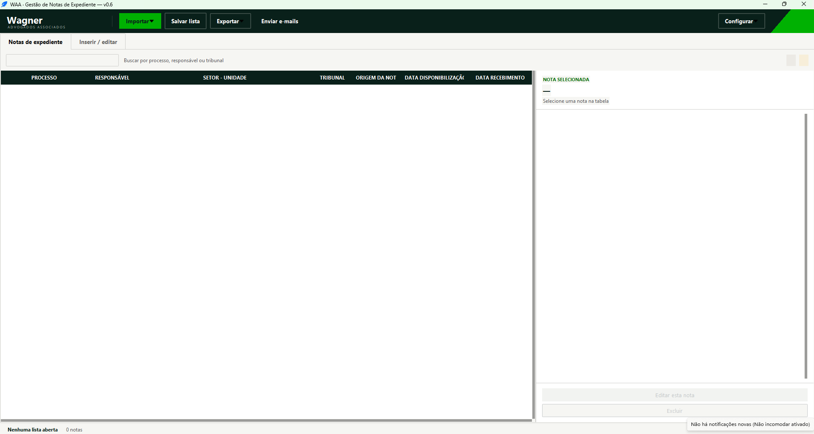
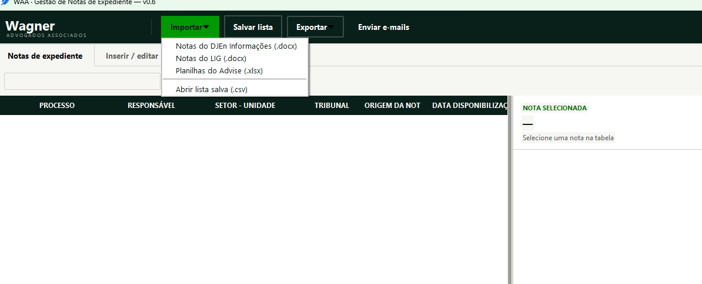
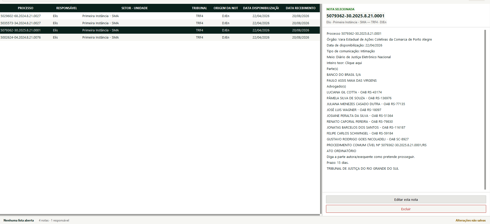
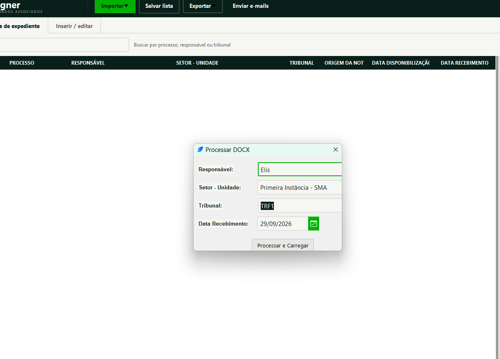
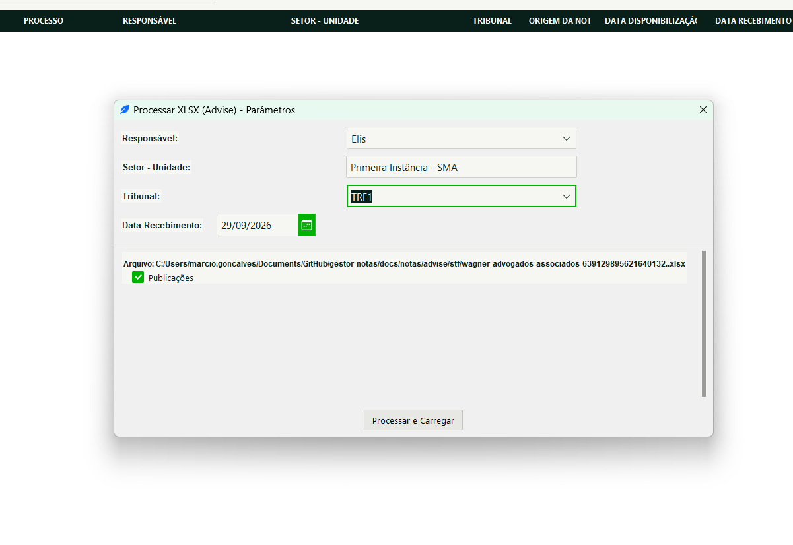
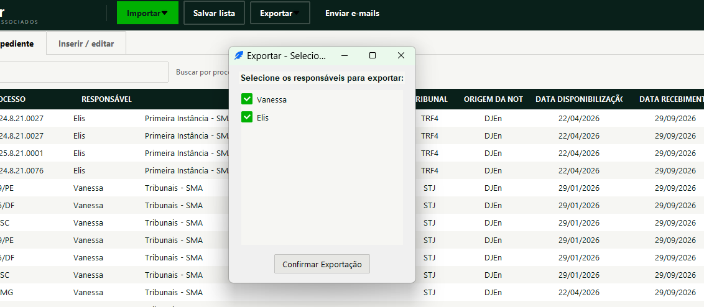
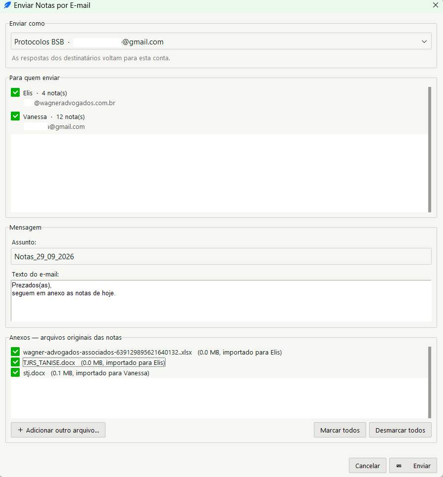
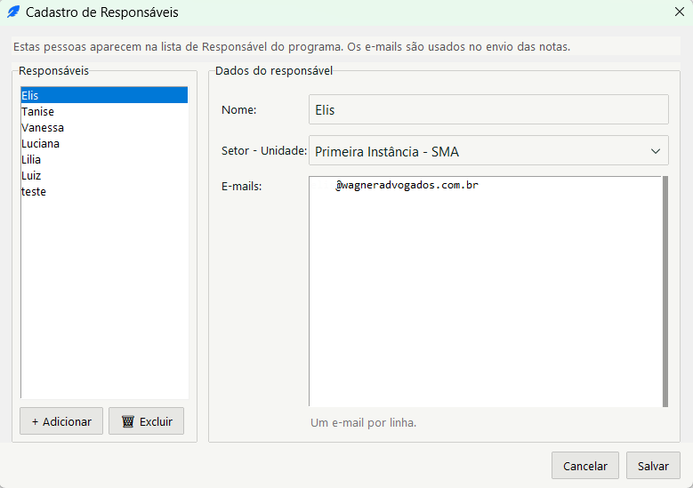

# Manual do Usuário — WAA · Gestor de Notas de Expediente

**Versão do programa:** v0.6

**Data deste manual:** 29/09/2026

**Commit de referência:** `d6e97b5`

Este manual é para quem **usa** o programa. Ele não trata de código nem de
instalação técnica — cada seção responde a uma tarefa do seu dia: importar,
conferir, salvar, gerar o documento, enviar.

---

## Sumário

1. [Para que serve o programa](#1-para-que-serve-o-programa)
2. [Antes de começar](#2-antes-de-começar)
3. [Abrir o programa pela primeira vez](#3-abrir-o-programa-pela-primeira-vez)
4. [Tour da tela](#4-tour-da-tela)
5. [Importar notas do DJEn Informações (Word)](#5-importar-notas-do-djen-informações-word)
6. [Importar publicações do LIG (Word)](#6-importar-publicações-do-lig-word)
7. [Importar notas do Advise (Excel)](#7-importar-notas-do-advise-excel)
8. [Cadastrar uma nota à mão](#8-cadastrar-uma-nota-à-mão)
9. [Encontrar, ler, editar e excluir notas](#9-encontrar-ler-editar-e-excluir-notas)
10. [Salvar e retomar o trabalho (arquivo CSV)](#10-salvar-e-retomar-o-trabalho-arquivo-csv)
11. [Gerar o documento de conferência em Word ou PDF](#11-gerar-o-documento-de-conferência-em-word-ou-pdf)
12. [Enviar as notas por e-mail](#12-enviar-as-notas-por-e-mail)
13. [Fechar o programa sem perder dados](#13-fechar-o-programa-sem-perder-dados)
14. [Configurar responsáveis, contas de envio e o arquivo de configuração](#14-configurar-responsáveis-contas-de-envio-e-o-arquivo-de-configuração)
15. [Problemas frequentes](#15-problemas-frequentes)
16. [Limites conhecidos desta versão](#16-limites-conhecidos-desta-versão)
17. [Glossário](#17-glossário)

---

## 1. Para que serve o programa

O programa reúne, em uma única lista de trabalho, as notas de expediente que
chegam ao escritório por três caminhos diferentes — **DJEn Informações**, **LIG**
e **Advise** — e transforma essa lista em um documento de conferência (Word ou
PDF), separado por responsável, com uma coluna de **Rubrica** para assinatura.

O ciclo normal de trabalho é este:

1. **Importar** os arquivos que você recebeu (Word ou Excel), ou cadastrar notas à mão.
2. **Conferir e corrigir** a lista na tela — o programa destaca as notas sem Data de Disponibilização.
3. **Salvar** a lista em um arquivo `.csv`, para retomar o trabalho depois.
4. **Gerar** o Word ou o PDF com o resumo de processos por responsável.
5. Se for o caso, **enviar** as notas por e-mail para cada responsável.

O documento gerado é um **resumo para conferência e rubrica**: ele traz o número
do processo, as datas, o tribunal e a origem — **não** o texto integral das notas.
O texto completo continua dentro do programa e dentro do arquivo `.csv`.

Quem usa: as pessoas responsáveis pelo controle de expediente. Os nomes que
aparecem na lista de **Responsável** vêm de um cadastro que você mesmo edita
dentro do programa (veja a [seção 14](#14-configurar-responsáveis-contas-de-envio-e-o-arquivo-de-configuração)).

---

## 2. Antes de começar

O programa é entregue pelo **Núcleo de Tecnologia** como um arquivo executável,
pronto para uso. Você **não precisa instalar nada**.

O que você precisa ter em mãos:

| Item | Observação |
|---|---|
| A pasta do programa | Entregue pelo Núcleo de Tecnologia, normalmente em um arquivo `.zip` |
| Um computador com Windows | O programa foi feito para Windows |
| Uma pasta sua para os arquivos de trabalho | É onde você vai salvar os `.csv` e os documentos gerados |

> ⚠️ **Mantenha a pasta do programa inteira.** Junto do `GestorNotas.exe` viajam
> dois arquivos de apoio, um deles chamado `config.json`. Copiar só o executável
> para outro lugar faz o programa abrir perguntando onde a configuração está, e
> o envio de e-mail fica sem conta remetente. Copie a pasta toda.

> Sugestão: crie uma pasta como `Documentos\Notas de Expediente` antes de começar.
> Você vai voltar a ela toda vez que salvar ou abrir uma lista.

---

## 3. Abrir o programa pela primeira vez

1. Abra a pasta do programa e dê **duplo clique** em `GestorNotas.exe`.
2. Aguarde alguns segundos. A primeira abertura costuma demorar mais que as seguintes.
3. A janela **WAA · Gestão de Notas de Expediente — v0.6** aparece, já na aba
   **Notas de expediente**, com a tabela vazia. No rodapé você lê
   **"Nenhuma lista aberta"** e **"0 notas"**.

> 
> A versão do programa aparece no título da janela. Informe esse número sempre
> que abrir um chamado.

**Se aparecer a pergunta "Configuração não encontrada"**, o programa não achou o
arquivo `config.json` ao lado dele. Isso acontece quando só o executável foi
copiado para a máquina. Veja o que fazer na
[seção 14](#quando-aparece-configuração-não-encontrada-na-abertura).

Se a janela não abrir, ou se o Windows exibir um aviso de segurança ao executar
o arquivo, acione o Núcleo de Tecnologia — veja
[Problemas frequentes](#15-problemas-frequentes).

---

## 4. Tour da tela

### A faixa escura do topo

É de onde partem todas as ações. Da esquerda para a direita:

| Botão | O que abre |
|---|---|
| **Importar** (verde) | Menu com: *Notas do DJEn Informações (.docx)*, *Notas do LIG (.docx)*, *Planilhas do Advise (.xlsx)* e *Abrir lista salva (.csv)* |
| **Salvar lista** | Guarda a lista atual em um arquivo `.csv` |
| **Exportar** | Menu com: *Documento de conferência em Word* e *Documento de conferência em PDF* |
| **Enviar e-mails** | Abre a janela de envio das notas aos responsáveis |
| **Configurar** (à direita) | Menu com o cadastro de responsáveis, as contas de envio e a localização do arquivo de configuração |

> 

### O rodapé

Uma linha discreta no pé da janela que responde três perguntas de uma vez:

- **À esquerda:** o nome do arquivo aberto, ou "Nenhuma lista aberta".
- **No meio:** as contagens — por exemplo `48 notas · 3 responsáveis · 5 sem data de disponibilização`.
- **À direita:** o aviso **"Alterações não salvas"**, quando existe trabalho ainda não gravado em `.csv`.

### A aba "Notas de expediente"

É onde você passa a maior parte do tempo.

**No alto**, o campo de busca, com a indicação *"Buscar por processo, responsável
ou tribunal"*. À direita da mesma linha ficam duas etiquetas: o total de notas e,
em amarelo, quantas estão sem data de disponibilização.

**À esquerda**, a tabela com todas as notas — ela rola, não tem páginas. As
colunas são: PROCESSO, RESPONSÁVEL, SETOR - UNIDADE, TRIBUNAL, ORIGEM DA NOTA,
DATA DISPONIBILIZAÇÃO e DATA RECEBIMENTO.

> As linhas com **fundo amarelado** e a palavra **"sem data"** na coluna de
> disponibilização são notas em que essa data ficou vazia ou saiu como "Não
> encontrada" na importação. São elas que precisam da sua conferência.
>
> O texto da nota **não aparece na tabela** — ele fica no painel da direita.

**À direita**, o painel **NOTA SELECIONADA**: o número do processo, a linha com
responsável, setor, tribunal e origem, o texto completo da nota e os botões
**Editar esta nota** e **Excluir**. Os dois botões ficam apagados enquanto
nenhuma linha estiver selecionada.

> 
> A divisória entre a tabela e o painel é arrastável: puxe-a para o lado se
> quiser mais espaço para ler a nota.

### A aba "Inserir / editar"

Usada para digitar uma nota nova ou corrigir uma existente.

- **À esquerda:** o campo grande **CONTEÚDO DA NOTA**.
- **À direita:** RESPONSÁVEL, SETOR · UNIDADE (preenchido sozinho), PROCESSO Nº,
  TRIBUNAL, ORIGEM DA NOTA, DATA DE DISPONIBILIZAÇÃO, DATA DE RECEBIMENTO e o
  botão verde de gravação.

---

## 5. Importar notas do DJEn Informações (Word)

**Pré-requisito:** ter o arquivo `.docx` recebido do DJEn salvo no computador.

1. Clique em **Importar → Notas do DJEn Informações (.docx)**.
2. Na caixa **"Selecione o arquivo DOCX"**, escolha **um** arquivo e clique em **Abrir**.
3. Abre a janela **Processar DOCX**. Preencha:

| Campo | O que fazer |
|---|---|
| **Responsável** | Escolha a pessoa. O primeiro nome do cadastro já vem selecionado — confira antes de seguir |
| **Setor - Unidade** | Preenchido sozinho a partir do responsável; não é editável aqui |
| **Tribunal** | Escolha o tribunal. **Obrigatório** |
| **Data Recebimento** | Já vem com a data de hoje. Troque se as notas chegaram em outro dia |

4. Clique em **Processar e Carregar**.
5. Aparece **"N notas extraídas e adicionadas."** O programa volta para a aba
   **Notas de expediente**, rola até o fim da lista e seleciona a última nota
   que entrou.

>  

**O que o programa lê do arquivo:** cada trecho que começa com a palavra
`Processo` seguida do número inicia uma nota nova; a linha
`Data de disponibilização:` preenche a data. Quando essa linha não existe, a
nota entra com **"Não encontrada"** e a linha aparece destacada para você
completar à mão.

> Escolhendo **STJ** no campo Tribunal, o programa também lê as tabelas do
> documento e, quando encontra ali o número do recurso, usa esse número no lugar
> do número do processo. É o formato em que o STJ envia as notas.

**Se aparecer "Nenhuma nota encontrada no documento selecionado."**, o arquivo
provavelmente não é do DJEn — veja [Problemas frequentes](#nenhuma-nota-encontrada-no-documento-selecionado).

---

## 6. Importar publicações do LIG (Word)

**Pré-requisito:** ter os arquivos `.docx` do LIG salvos no computador.

1. Clique em **Importar → Notas do LIG (.docx)**.
2. Na caixa **"Selecione arquivos DOCX (LIG)"**, escolha **um ou vários**
   arquivos de uma vez (segure `Ctrl` para marcar mais de um) e clique em **Abrir**.
3. Na janela **Processar DOCX (LIG) - Parâmetros**, preencha Responsável,
   Tribunal e Data Recebimento.

> Aqui o **Tribunal é opcional** — diferente da importação do DJEn. Deixando em
> branco, as notas entram sem tribunal, e a coluna fica vazia na tabela e no
> documento gerado. Preencher agora poupa a correção depois.

4. Clique em **Processar e Carregar**.
5. Aparece **"N publicações extraídas e adicionadas."**

**O que o programa lê do arquivo:** o conteúdo da **primeira tabela** do
documento, dividido a cada trecho `Publicação X de Y`. Dentro de cada
publicação, ele procura `Processo:` para o número e `Data da Publicação` para a
data. Sem essa data, a nota entra como **"Não encontrada"**.

---

## 7. Importar notas do Advise (Excel)

**Pré-requisito:** ter as planilhas `.xlsx` do Advise salvas no computador.

1. Clique em **Importar → Planilhas do Advise (.xlsx)**.
2. Na caixa **"Selecione arquivos XLSX (Advise)"**, escolha um ou vários
   arquivos e clique em **Abrir**.
3. Abre a janela **Processar XLSX (Advise) - Parâmetros**. Preencha Responsável,
   **Tribunal** (obrigatório) e Data Recebimento.
4. Na parte de baixo, o programa lista **cada arquivo e as abas dentro dele**,
   com uma caixa de marcação por aba. Todas vêm marcadas — desmarque as que não
   quiser importar.
5. Clique em **Processar e Carregar**.
6. Aparece **"N registros importados de Advise."**

> 

**O que o programa lê da planilha:** ele procura, **nas dez primeiras linhas** de
cada aba, uma linha de cabeçalho que contenha `PROCESSO` ou `DISPONIBILIZAÇÃO`.
A partir dali, cada linha preenchida vira uma nota: a coluna de processo vira o
número do processo, a de disponibilização vira a data, e o **Conteúdo** é montado
juntando todas as células daquela linha, na ordem em que aparecem.

---

## 8. Cadastrar uma nota à mão

Use quando a nota não veio em arquivo, ou quando você precisa acrescentar uma
que faltou.

1. Abra a aba **Inserir / editar**.
2. Escolha o **RESPONSÁVEL**. O campo SETOR · UNIDADE se preenche sozinho.
3. Digite o **PROCESSO Nº**.
4. Escolha o **TRIBUNAL**.
5. Em **ORIGEM DA NOTA**, escolha DJEn, LIG ou Advise na lista — ou **digite
   outro texto**, se a nota veio por outro caminho.
6. Preencha as duas datas. Cada campo aceita a data digitada no formato
   `dd/mm/aaaa` ou escolhida no calendário, pelo botão ao lado do campo.
7. Cole ou digite o texto da nota no campo **CONTEÚDO DA NOTA**, à esquerda.
8. Clique em **Adicionar à lista**.
9. Aparece **"Processo adicionado com sucesso!"** e o programa volta para a aba
   **Notas de expediente**, com a nota nova selecionada no fim da lista.

**Dois campos são obrigatórios.** Sem eles o programa avisa e não grava:

- **"Selecione um Responsável antes de continuar."**
- **"O campo Processo é obrigatório."**

---

## 9. Encontrar, ler, editar e excluir notas

### Encontrar

Digite no campo de busca, no alto da aba **Notas de expediente**. A tabela é
filtrada enquanto você digita. A busca olha o número do processo, o responsável,
o setor, o tribunal e a origem — não o texto da nota.

A etiqueta à direita mostra quantas notas estão à vista, por exemplo
`12 de 48 notas`. Apague o que digitou para ver a lista inteira de novo.

> A busca muda só o que você **vê**. O documento gerado e o e-mail continuam
> considerando a lista toda — veja as seções [11](#11-gerar-o-documento-de-conferência-em-word-ou-pdf)
> e [12](#12-enviar-as-notas-por-e-mail).

### Ordenar

Clique no **título de uma coluna** para ordenar por ela; clique de novo para
inverter. Uma seta ▲ ou ▼ marca a coluna ativa. As notas com o campo vazio ficam
sempre no fim, nos dois sentidos — uma nota sem data é pendência, não é "a data
mais antiga".

### Ler o texto completo

Clique na linha. O painel da direita mostra o processo, os dados e o texto
inteiro da nota.

### Editar

1. Selecione a linha e clique em **Editar esta nota** — ou dê **duplo clique** na linha.
2. O programa abre a aba **Inserir / editar** com todos os campos preenchidos, e
   o botão passa a se chamar **Salvar alterações**.
3. Corrija o que precisa e clique em **Salvar alterações**.
4. Aparece **"Registro atualizado com sucesso!"**

> É assim que se resolve uma linha amarelada: selecione, edite, preencha a
> DATA DE DISPONIBILIZAÇÃO e salve. O destaque some da tabela e a contagem do
> rodapé diminui.

### Excluir

1. Selecione a linha e clique em **Excluir** — ou aperte a tecla `Delete`.
2. Confirme em **"Tem certeza que deseja excluir esta nota definitivamente?"**.
3. Aparece **"Registro excluído."**

> ⚠️ Não existe desfazer. A única forma de recuperar uma nota excluída é abrir
> de novo um `.csv` salvo antes da exclusão.

---

## 10. Salvar e retomar o trabalho (arquivo CSV)

O `.csv` é o arquivo de trabalho do programa: é ele que guarda **tudo**,
inclusive o texto completo das notas. Salve com frequência — não há salvamento
automático.

### Salvar

1. Clique em **Salvar lista**.
2. Escolha a pasta. O nome sugerido é `Notas_Expediente.csv` — troque por algo
   que identifique o lote, como `notas_20_08_2026.csv`.
3. Clique em **Salvar**.
4. Aparece **"Lista salva"** com o caminho do arquivo. O aviso
   **"Alterações não salvas"** some do rodapé, e o nome do arquivo passa a
   aparecer à esquerda.

Com a lista vazia, o programa avisa **"Não há dados para salvar."**

### Retomar

1. Clique em **Importar → Abrir lista salva (.csv)**.
2. Escolha o arquivo e clique em **Abrir**.
3. Aparece **"Lista aberta — N notas carregadas."**

> ⚠️ **Abrir uma lista substitui o que está na tela.** Se houver trabalho não
> salvo, salve antes.

O arquivo abre no Excel para consulta. Se você editar por lá, mantenha a
primeira linha de títulos, a ordem das colunas e o ponto e vírgula como
separador — fora disso o programa não consegue ler o arquivo de volta.

---

## 11. Gerar o documento de conferência em Word ou PDF

1. Clique em **Exportar → Documento de conferência em Word** (ou **em PDF**).
2. Abre a janela **Exportar - Selecionar Responsáveis**, com uma caixa marcada
   para cada responsável que tem notas na lista. Desmarque quem não entra neste
   documento.
3. Clique em **Confirmar Exportação**.
4. Escolha a pasta. O nome já vem sugerido como `notas_20_08_2026.docx` (ou
   `.pdf`) — a data é a **de recebimento** das notas exportadas, não a de hoje.
   Havendo mais de uma, vale a mais recente.
5. Clique em **Salvar**.
6. Aparece **"Word gerado:"** ou **"PDF gerado!"** com o caminho do arquivo.
   
> 

Com a lista vazia, o programa avisa **"Não há dados."** Sem marcar ninguém, ele
avisa **"Selecione pelo menos um responsável."**

### O que sai no documento

Para **cada responsável selecionado**, começando em uma página nova:

- O título **NOTAS DE EXPEDIENTE**.
- O nome do responsável e o **Setor - Unidade**.
- Um bloco para cada combinação de datas, com Tribunal, Origem da Nota,
  Data de Disponibilização e Data de Recebimento.
- A tabela **Processo | Rubrica**, com a segunda coluna em branco para assinatura.

> O documento **não traz o texto das notas** — ele é um resumo para conferência.
> O texto continua no programa e no arquivo `.csv`.

> A busca digitada na tela **não** limita a exportação: entram todas as notas dos
> responsáveis marcados. Para exportar um recorte menor, exclua o que não entra
> ou trabalhe a partir de um `.csv` separado.

---

## 12. Enviar as notas por e-mail

O programa envia **uma mensagem por responsável**, para os endereços cadastrados
daquela pessoa, com os arquivos que você escolher em anexo.

**Pré-requisitos:**

- Ter notas na lista (com a lista vazia, aparece **"Não há notas na lista para enviar."**).
- Ter ao menos uma conta de envio cadastrada — veja a [seção 14](#contas-de-envio-remetentes).
- Ter e-mails cadastrados para os responsáveis que vão receber.

### Passo a passo

1. Clique em **Enviar e-mails**. Abre a janela **Enviar Notas por E-mail**.
   O envio é real: as mensagens vão para os endereços cadastrados de cada
   responsável, sem ensaio e sem desfazer.
2. Em **Enviar como**, escolha a conta que assina a mensagem. A primeira da lista
   já vem selecionada, e é para ela que as respostas voltam. Havendo uma conta só,
   o endereço aparece escrito, sem lista.
3. Em **Para quem enviar**, marque os responsáveis. Cada linha traz o nome e
   quantas notas são daquela pessoa; logo abaixo, em cinza, os endereços para
   onde a mensagem vai — todos eles, um do lado do outro, mesmo quando são
   vários. Havendo mais responsáveis do que cabe na área, ela **rola**: use a
   barra à direita ou a roda do mouse. Quem está **"(sem e-mail cadastrado)"**
   aparece apagado e não pode ser marcado — cadastre o endereço na
   [seção 14](#responsáveis-setores-e-e-mails) e volte aqui.
4. Em **Mensagem**, confira o **Assunto** — já vem padronizado como
   `Notas_20_08_2026` (dia_mês_ano) — e o texto, que vem com uma redação padrão.
   Os dois podem ser alterados. O assunto vai igual para todos os responsáveis:
   o nome de cada um **não** é mais acrescentado ao final.
5. Em **Anexos — arquivos originais das notas**, confira os arquivos a enviar.
   Já vêm **marcados** os que você acabou de importar ou de escolher e que
   ainda não saíram em nenhum e-mail desta sessão; os que já foram enviados
   aparecem desmarcados, para não repetirem o envio sem querer. **Marcar
   todos** e **Desmarcar todos** resolvem a lista inteira de uma vez.

> Aparecem aqui os arquivos que **você importou nesta sessão** do programa, com o
> tamanho de cada um. O Word ou o PDF que você acabou de gerar **não entra
> sozinho** — clique em **＋ Adicionar outro arquivo…** e escolha o documento.
>
> Se você clicar em **✉️ Enviar** sem marcar nenhum anexo, o programa pergunta
> antes de seguir — o texto padrão promete anexo, então o mais provável é
> esquecimento.
>
> Os anexos de uma mensagem somam no máximo **20 MB**. Acima disso o envio falha
> e o programa avisa — mande menos arquivos por vez.

6. Clique em **✉️ Enviar**.
7. Confira a janela de confirmação: ela repete o remetente, quantas mensagens
   serão enviadas, para quais endereços e quantos anexos. Clique em **Sim**.
9. O rodapé mostra **"Enviando…"**. Ao terminar, aparece o
   **Resultado do envio**: `Enviadas: 3 de 3`, o remetente usado e, se algo
   falhou, a lista das falhas com o motivo de cada uma.

>  

Dando tudo certo, a janela se fecha sozinha. Havendo falhas, ela permanece
aberta, para você corrigir e tentar de novo.

---

## 13. Fechar o programa sem perder dados

Ao clicar no **X** da janela com alterações pendentes, aparece a pergunta
**"Existem alterações não salvas. Deseja salvar antes de sair?"**:

- **Sim** — abre a janela de salvar o `.csv` e, depois de gravar, fecha o programa.
- **Não** — fecha e descarta as alterações.
- **Cancelar** — volta para o programa sem fechar.

Escolhendo Sim e cancelando a janela de salvar, o programa **não fecha** — é uma
proteção contra perda acidental.

---

## 14. Configurar responsáveis, contas de envio e o arquivo de configuração

Tudo o que o programa deixa você configurar fica no menu **Configurar**, no canto
direito da faixa superior. Nada disso exige uma nova versão do programa.

### Responsáveis, setores e e-mails

**Configurar → Responsáveis, setores e e-mails** abre a janela **Cadastro de
Responsáveis**. São essas pessoas que aparecem na lista de **Responsável**, e são
esses e-mails que o envio usa.

À esquerda, a lista de quem já está cadastrado — quem estiver sem endereço
aparece marcado com **"(sem e-mail)"**. À direita, os dados de quem você
selecionou:

| Campo | O que preencher |
|---|---|
| **Nome** | Como o nome aparece na lista do programa e no documento gerado |
| **Setor - Unidade** | Por exemplo `Tribunais - SMA`. A lista sugere os setores já usados, e você pode digitar um novo |
| **E-mails** | **Um endereço por linha.** Todos recebem a mensagem daquela pessoa |

1. Clique em **+ Adicionar** para incluir alguém, ou selecione um nome na lista
   para alterar.
2. Preencha os campos.
3. Clique em **Salvar**.
4. Aparece **"N responsáveis gravados. A lista do programa já está atualizada."**

Para remover, selecione o nome e clique em **🗑 Excluir**. Excluir alguém do
cadastro **não apaga** as notas já lançadas para essa pessoa — apenas o nome
deixa de aparecer na lista.

O programa confere tudo antes de gravar. Se algo estiver faltando, aparece
**"Corrija antes de salvar"** com a lista dos problemas — nome em branco, setor
em branco, nome repetido ou endereço que não parece um e-mail válido.

> 

### Contas de envio (remetentes)

**Configurar → Contas de envio (remetentes)** abre a janela **Contas de Envio**,
com as contas do Google que assinam as mensagens. São elas que aparecem em
**Enviar como**.

| Campo | O que é |
|---|---|
| **Rótulo** | O nome que aparece na tela, como "Protocolos BSB". Em branco, aparece o próprio endereço |
| **E-mail** | O endereço que assina a mensagem. É para ele que as respostas voltam |
| **Senha de app** | A senha de app do Google, de 16 caracteres — **não** é a senha normal da conta |

A senha aparece escondida no campo; marque **Mostrar senha** para conferir o que
digitou.

A **primeira conta da lista** é a que a janela de envio já traz selecionada — ela
aparece marcada com **← padrão**. Para trocar, selecione outra e clique em
**↑ Tornar padrão**.

> A senha de app é gerada na Conta Google, em **Segurança → Verificação em duas
> etapas → Senhas de app**. Sem acesso a essa tela, peça ao Núcleo de Tecnologia.

Uma conta sem endereço ou sem senha não é gravada: o programa avisa
**"informe a senha de app do Google"** antes de salvar. É proposital — uma conta
pela metade só daria erro na hora do envio, com as notas já esperando.

### Onde essas informações ficam guardadas

Tudo vai para um arquivo chamado **`config.json`**, na mesma pasta do programa.
Ele guarda responsáveis, setores, e-mails, tribunais, partes adversas e as contas
de envio. Ao salvar, o programa guarda uma cópia do arquivo anterior com o final
`.bak`, então uma edição errada não é definitiva.

> 🔒 Como o `config.json` guarda as senhas de app, ele merece o mesmo cuidado de
> uma senha anotada: não o envie por e-mail nem o deixe em pasta compartilhada
> com quem não deveria enviar mensagens em nome do escritório.

### Quando aparece "Configuração não encontrada" na abertura

Significa que o `config.json` não está ao lado do programa. A pergunta mostra
onde ele foi procurado e oferece **"Deseja localizar o arquivo agora?"**:

- **Sim** abre a caixa de procurar arquivos. Encontre o `config.json` — na pasta
  de rede, no pen drive, na pasta de onde o programa foi copiado — e clique em
  **Abrir**. O programa passa a usar esse arquivo e **lembra dele** nas próximas
  aberturas.
- **Não** deixa o programa abrir assim mesmo. Ele funciona, mas com uma lista de
  responsáveis de origem e **nenhuma conta de envio disponível**.

A qualquer momento você faz o mesmo por **Configurar → Localizar o arquivo
config.json…**, que também serve para apontar o programa para outro arquivo — o
`config.json` compartilhado da equipe, por exemplo.

Depois de escolher, o programa confirma o caminho e informa quantos responsáveis
e quantas contas de envio encontrou. Se o arquivo escolhido estiver corrompido,
ele recusa com **"O arquivo escolhido não é um JSON válido"** e continua com o
que já estava usando.

### Recarregar configuração do disco

**Configurar → Recarregar configuração do disco** relê o `config.json` sem fechar
o programa. Serve para quando outra pessoa alterou o arquivo enquanto você estava
com ele aberto.

---

## 15. Problemas frequentes

### O programa não abre, ou o Windows exibe um aviso ao executar o arquivo

**Causa:** o arquivo pode ter sido bloqueado pelo Windows ou pelo antivírus depois do download.
**Solução:** acione o Núcleo de Tecnologia. Não tente contornar o aviso por conta própria.

### "Configuração não encontrada" toda vez que abro o programa

**Causa:** o `config.json` não está ao lado do `GestorNotas.exe` — normalmente porque só o executável foi copiado.
**Solução:** copie a pasta inteira do programa, ou aponte o arquivo em **Configurar → Localizar o arquivo config.json…**. Veja a [seção 14](#quando-aparece-configuração-não-encontrada-na-abertura).

### "Nenhuma nota encontrada no documento selecionado."

**Causa:** o arquivo do DJEn não tem trechos começando com a palavra `Processo` — em geral porque o arquivo é de outra origem.
**Solução:** confirme que o arquivo é mesmo do DJEn Informações. Sendo do LIG, use **Importar → Notas do LIG (.docx)**.

### "Nenhuma publicação encontrada nos arquivos selecionados."

**Causa:** o arquivo do LIG não tem tabela, ou o conteúdo está fora da primeira tabela do documento.
**Solução:** abra o `.docx` no Word e confirme que as publicações estão na primeira tabela. Estando nas seguintes, o programa não as lê nesta versão.

### "Nenhuma nota encontrada nas planilhas selecionadas."

**Causa:** o cabeçalho com `PROCESSO` ou `DISPONIBILIZAÇÃO` não está nas dez primeiras linhas da planilha, ou as abas marcadas estão vazias.
**Solução:** apague as linhas em branco acima do cabeçalho na planilha e importe de novo.

### "Biblioteca openpyxl não encontrada. Instale com: pip install openpyxl"

**Causa:** o componente de leitura de planilhas não veio junto nesta cópia do programa.
**Solução:** abra um chamado no Núcleo de Tecnologia informando essa mensagem e a versão do programa. A instrução técnica dentro do aviso não se aplica ao executável.

### Muitas linhas aparecem amareladas, com "sem data"

**Causa:** a Data de Disponibilização não foi encontrada no arquivo importado.
**Solução:** clique na linha, use **Editar esta nota**, preencha a data e clique em **Salvar alterações**. Repita para cada linha destacada — a contagem no rodapé diminui a cada correção.

### "Erro ao carregar arquivo: ..."

**Causa:** o `.csv` está aberto em outro programa, ou não usa ponto e vírgula como separador.
**Solução:** feche o arquivo no Excel e tente de novo. Se você o editou à mão, confirme o separador `;` e a ordem original das colunas.

### "Erro ao salvar: ..." / "Erro Word: ..." / "Erro PDF: ..."

**Causa mais comum:** o arquivo de destino está aberto no Excel ou no Word, e o Windows impede a gravação.
**Solução:** feche o arquivo de destino e repita a operação.

### "Configuração de e-mail incompleta"

**Causa:** não há nenhuma conta de envio completa disponível — falta o endereço ou a senha de app.
**Solução:** cadastre a conta em **Configurar → Contas de envio (remetentes)**. Persistindo, acione o Núcleo de Tecnologia, como o próprio aviso indica.

### "O Google recusou o login."

**Causa:** o endereço ou a senha da conta de envio estão errados, ou o que foi cadastrado é a senha normal da conta em vez da senha de app.
**Solução:** confira em **Configurar → Contas de envio (remetentes)**, com **Mostrar senha** marcado. A senha de app tem 16 caracteres e é gerada na Conta Google, em Segurança → Verificação em duas etapas → Senhas de app.

### "Sem permissão para ler o anexo (ele está aberto?)"

**Causa:** o arquivo que você mandou anexar está aberto no Word ou no Excel.
**Solução:** feche o arquivo e clique em **✉️ Enviar** de novo.

### "Os anexos somam X MB e o limite é 20 MB."

**Causa:** os arquivos marcados na área de anexos passam do tamanho que o Gmail aceita.
**Solução:** desmarque parte dos arquivos e faça mais de um envio.

### "Não foi possível conectar ao servidor de e-mail"

**Causa:** falta de internet no momento do envio, ou bloqueio de rede.
**Solução:** confira a conexão e tente de novo. Persistindo, acione o Núcleo de Tecnologia.

### O nome de um responsável não aparece na lista

**Causa:** a pessoa ainda não está no cadastro, ou o `config.json` em uso não é o que você imagina.
**Solução:** inclua o nome em **Configurar → Responsáveis, setores e e-mails**. Se o cadastro abrir vazio ou desatualizado, confira qual arquivo o programa está usando em **Configurar → Localizar o arquivo config.json…**.

---

## 16. Limites conhecidos desta versão

- **Não há salvamento automático.** Salve o `.csv` com frequência.
- **Abrir uma lista salva substitui** o que está na tela, sem mesclar.
- **Não existe desfazer.** Uma exclusão confirmada só se recupera abrindo um `.csv` salvo antes.
- **O Word e o PDF não trazem o texto das notas**, apenas o resumo por processo com a coluna de rubrica.
- **A busca não limita a exportação nem o envio** — os dois consideram a lista inteira dos responsáveis marcados.
- **O documento gerado não é anexado sozinho** ao e-mail: acrescente-o em **＋ Adicionar outro arquivo…**.
- **A importação do LIG lê apenas a primeira tabela** de cada documento.
- **A importação do Advise monta o Conteúdo juntando todas as células da linha**, na ordem em que aparecem na planilha.
- **Logo depois de abrir uma lista salva**, o rodapé já mostra "Alterações não salvas", mesmo sem você ter mudado nada. É um aviso a mais, nunca a menos.
- **Tribunais e partes adversas não têm tela de edição** — mudam pelo `config.json`, direto no arquivo. Responsáveis e contas de envio, sim: veja a [seção 14](#14-configurar-responsáveis-contas-de-envio-e-o-arquivo-de-configuração).

---

## 17. Glossário

| Termo | Significado neste programa |
|---|---|
| **Nota de expediente** | Cada publicação ou intimação registrada, com processo, datas e texto |
| **DJEn Informações** | Diário de Justiça Eletrônico Nacional; origem dos arquivos Word importados por *Importar → Notas do DJEn Informações* |
| **LIG** | Serviço de recorte de publicações cujos arquivos Word são importados por *Importar → Notas do LIG* |
| **Advise** | Sistema cujas planilhas Excel são importadas por *Importar → Planilhas do Advise* |
| **Data Disponibilização** | Data em que a publicação foi disponibilizada pelo tribunal |
| **Data Recebimento** | Data em que o escritório recebeu a nota; nas importações, a data escolhida na janela de parâmetros |
| **Origem da Nota** | De onde a nota veio: DJEn, LIG, Advise ou outro texto digitado por você |
| **Responsável** | A pessoa a quem a nota pertence; define a separação do documento gerado e o destinatário do e-mail |
| **Setor - Unidade** | O setor e a unidade do responsável, preenchido a partir do cadastro |
| **Rubrica** | Coluna em branco no documento gerado, para assinatura de conferência |
| **Remetente** | A conta de e-mail que assina o envio, escolhida em *Enviar como* |
| **Senha de app** | Senha de 16 caracteres gerada na Conta Google, usada só pelo programa para enviar as mensagens |
| **CSV** | Arquivo em formato de tabela onde o programa guarda e recupera a lista; abre no Excel |
| **DOCX** | Arquivo do Microsoft Word |
| **XLSX** | Arquivo do Microsoft Excel |
